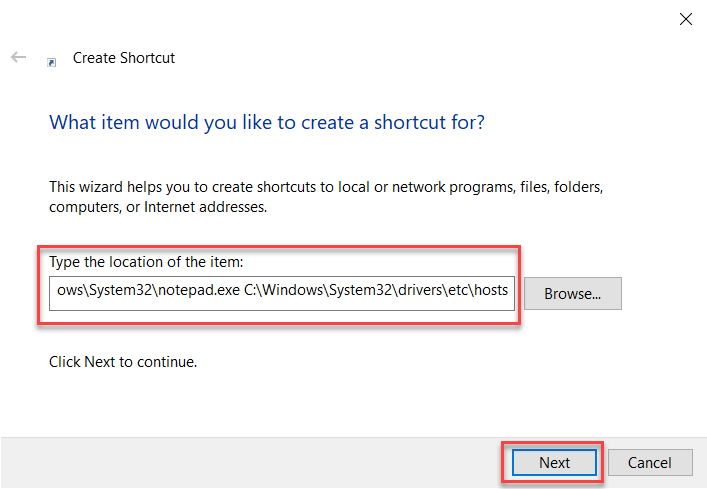
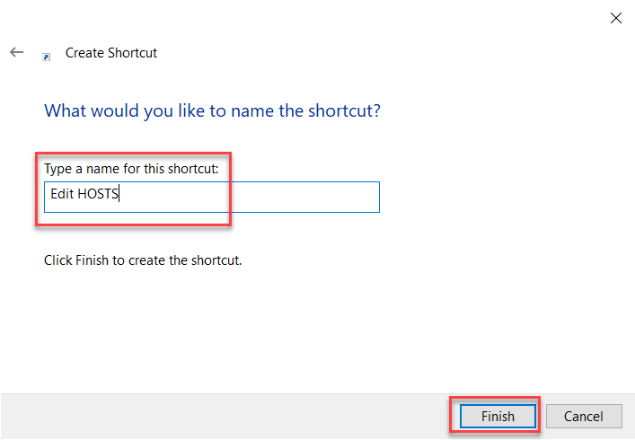
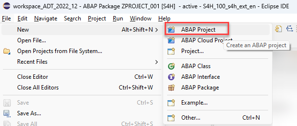
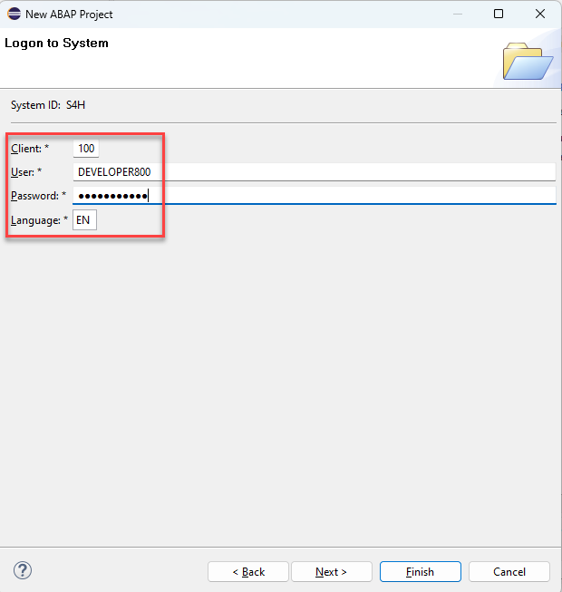
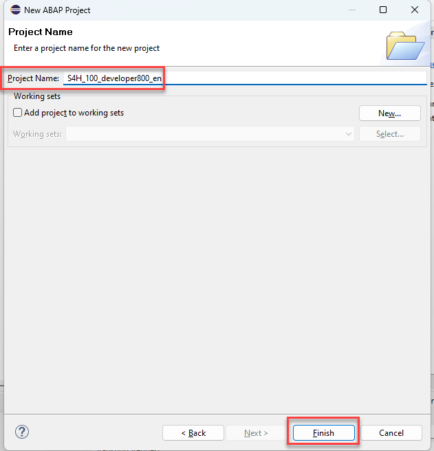

# How to log on to a SAP S/4HANA Fully-Activated Appliance system

- [1.1 - How to edit the HOSTS file](#how-to-edit-the-hosts-file-when-using-a-sap-s4hana-2022-preconfigured-appliance-system)
- [1.2 - How to create an ABAP project in ADT](#how-to-create-an-abap-project-in-adt)

## How to edit the HOSTS file when using a SAP S/4HANA 2022 preconfigured appliance system

ABAP cloud workshops can also be run on SAP S/4HANA 2022 systems. Here we make use of the so called *Preconfigured Appliance* systems that are available for SAP S/4HANA 2022.
These servers as a default use a generic host name which will not be resolved by your network settings by default.  
Therefore you can either replace the string **vhcals4hcs.dummy.nodomain** in the browser URL with the IP adress provided to you by the workshop instructor or you add the information how to resolve this hostname with the IP adress of your SAP S/4HANA demo system.

You will add a short cut to your desktop that lets you display / edit the HOSTS file conviniently using notepad.exe.   

 
Click to expand!

1. Right click on your desktop 
2. Select **New > Shortcut**.

   .

3. In the *Create Shortcut* dialogue enter the following string and press **Next**:
   `C:\Windows\System32\notepad.exe C:\Windows\System32\drivers\etc\hosts`. 
   
   .
   
4. Provide the shortcut with a meaningful name such as **Edit HOSTS**.

   .

5. Right click on the newly created shortcut and select **Run as administrator**.   
 
   .

7. Confirm the popup of the User Accesss Control that needs the confirmation that you are OK with notepad being started with administrative rights

8. Enter the following three lines at the bottom of your HOSTS file, where xxx.xxx.xxx.xxx has to be replaced by the IP adress of your SAP S/4HANA preconfigured appliance system.

<pre>
# Customer Workshops Template SAP S/4HANA 2022
xxx.xxx.xxx.xxx vhcals4hcs.dummy.nodomain
#
</pre>

8. Save your changes 

## How to create an ABAP project in ADT  

This document describes how to create a **ABAP Project** to connect to an SAP S/4HANA on premise or private cloud system.  The screen shots taken use a preconfigured appliance system 

 
Click to expand!

1. Click on  **File > New > New ABAP Project**

   

2. In the *System Connection* dialogue click on the link **new system connection**  

   

3. In the *Connection Settings* dialogue choose the connection type **Custom Application Server**  
   
   Then enter the following connection information
   - System ID: S4H
   - Application Server: xxx.xxx.xxx.xxx
   - Instance Number: 00
   
   and **deactivate** the check box **Activate Secure Network Communication (SNC)**
   
   Press Next.   

   

4. In the *Logon to System* dialogue enter the following data
    
   - Client: xxx
   - User: DEVELOPER###
   - Password: xxxxxxxx
   - Language: xx

   Press Next

   
   
5. In the *Project Name* screen you can choose an individual name for your project or leave the default value proposed by ADT.
  
   

6. Press **Finish**.   
   

