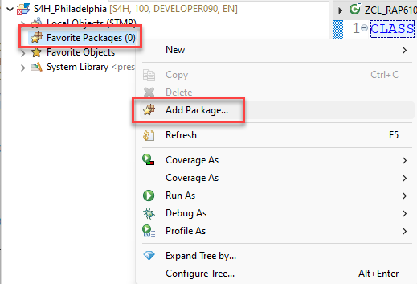
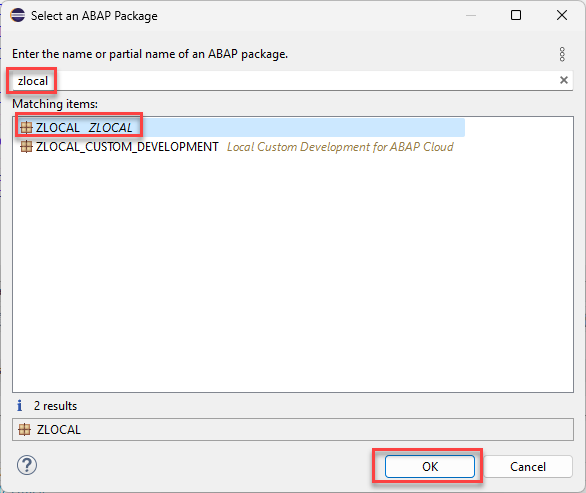

# How to connect to an SAP S/4HANA on premise system (DSAG-Technologietage 2023)

This document describes how to create a **ABAP Project** to connect to an SAP S/4HANA on premise or private cloud system.  
The screen shots taken use a preconfigured appliance system as it is used in various workshops of the SAP ABAP Platform PM team.  

 
Click to expand!

1. Click on  **File > New > New ABAP Project**

   

2. In the *System Connection* dialogue click on the link **new system connection**  

   

3. In the *Connection Settings* dialogue choose the connection type **Custom Application Server**  
   
   Then enter the following connection information
   - System ID: S4H
   - Application Server: xxx.xxx.xxx.xxx
   - Instance Number: 00
   
   and **deactivate** the check box **Activate Secure Network Communication (SNC)**
   
   Press Next.   

   

4. In the *Logon to System* dialogue enter the following data
    
   - Client: xxx
   - User: DEVELOPER###
   - Password: xxxxxxxx
   - Language: xx

   Press Next

   
   
5. In the *Project Name* screen you can choose an individual name for your project or leave the default value proposed by ADT.
  
   

6. Press **Finish**.   

7. Add `ZLOCAL` to your favorites packages.  

   - Right click on the folder **Favorite Packages** in your newly created ABAP project.   

     
   
   - Search for `ZLOCAL`. Select the entry and press **OK**.   
   
    
   
 
   

