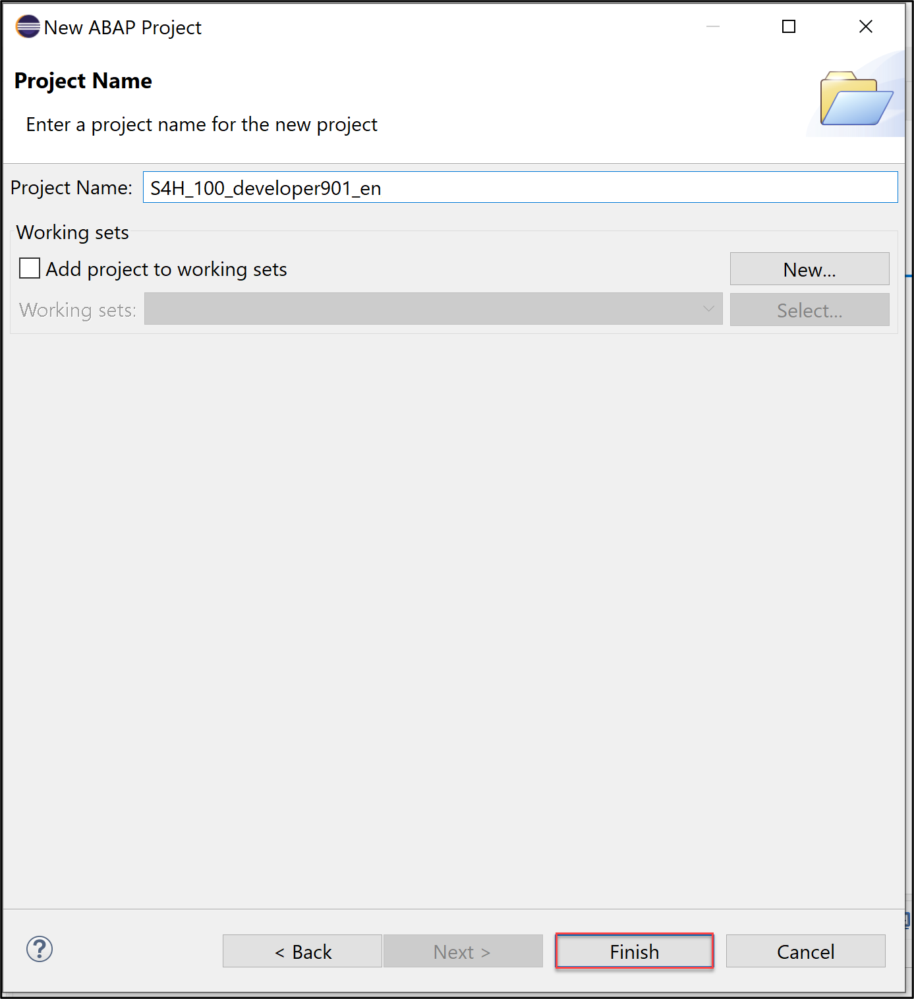

# How to connect to an SAP S/4HANA on premise system (DSAG-Technologietage 2023)

This document describes how to create a **ABAP Project** to connect to an SAP S/4HANA on premise system-  

 
Click to expand!

1. Click on  **File > New > ABAP Project** to create a new ABAP project.

   

2. In the *System Connection* select **S4H** and click **Next >**. The system **S4H** is already configured in SAP logon. 

   

3. Click **Next >**.   

   

4. Click **Next >**.

   
   
5. In the *Project Name* screen you can choose an individual name for your project or leave the default value proposed by ADT.
  
   

6. Press **Finish**.   

7. Add `ZLOCAL` to your favorites packages.  

   - Right click on the folder **Favorite Packages** in your newly created ABAP project.   

     
   
   - Search for `ZLOCAL`. Select the entry and press **OK**.   
   
    
   
 
   

