# TOC
[Home](../../README.md#exercises)
# Exercise 1: Create Database Table and Generate UI Service

## Introduction

In this exercise, you will create an ABAP package and database table. In your database table you will define all important fields. 

With ADT you will be able to define all needed repository objects for a starter application using a wizard. This includes the data model, projection view, service definition and service binding. Afterwards you will check your _Inventory_ application with the SAP Fiori elements preview. 

- [1.1 - Create Package](#exercise-11-create-package)
- [1.2 - Create database table](#exercise-12-create-database-table)
- [1.3 - Generate the transactional UI services](#exercise-13-generate-the-transactional-ui-services)
- [1.4 - Adapt the generated code](#exercise-14-adapt-the-generated-code)
- [1.5 - Preview the Travel App](#exercise-15-preview-the-inventory-app)
- [Summary](#summary)
- [Appendix](#appendix)


> **Reminder:**   
> Don't forget to replace all occurences of the placeholder **`###`** with a unique group ID in the exercise steps below.  
> You can use the ADT function **Replace All** (**Ctrl+F**) to replace all occurencies of the placeholder **`###`** with your unique ID.  
> A good try for a unique ID would be to use your initials and a number of your choice.  
> When creating your package **`ZRAP620_###`** you will see which unique ID is still available.      

## Exercise 1.1: Create Package
[^Top of page](#)

> Create your exercise package .   
> This ABAP package will contain all the artefacts you will be creating in the different exercises of this hands-on session.

 <details>
  <summary>Click to expand!</summary>

   1. In ADT, go to the **Project Explorer**, right-click on the package **`ZLOCAL`**, and select **New** > **ABAP Package** from the context menu. 
     
      
   
   2. Maintain the required information (`###` is your group ID):
       - Name: **`ZRAP620_###`**
       - Description: _**`RAP620 Package ###`**_
       - Select the box **Add to favorites package**
       
      Click **Next**.
 
      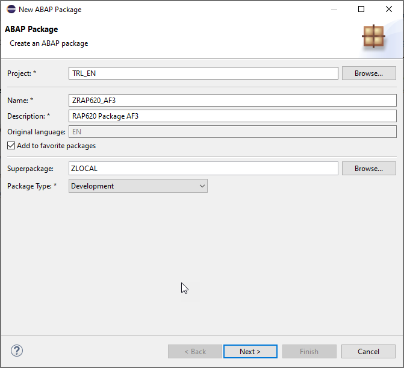
      
   
   3. Create a new transport request and add a description (e.g. _**RAP620 Package ###**_), and click **Finish**.
      
       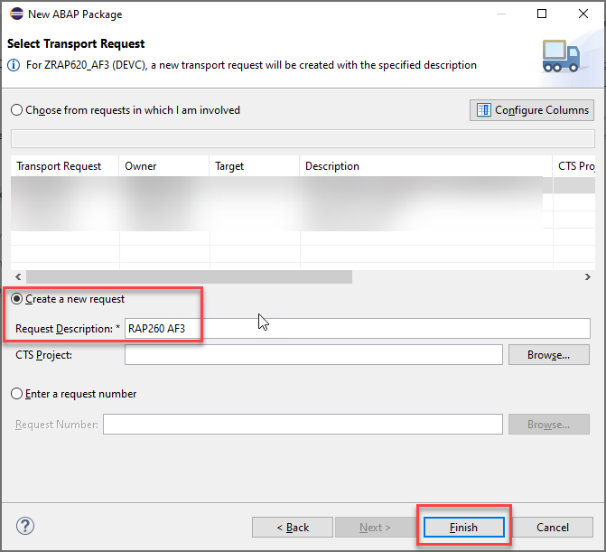

   4. Your Project Explorer should now look like follows:   
 
      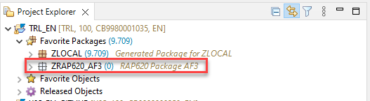
 
</details>

## Exercise 1.2: Create database table
[^Top of page](#)

> Create a database table  to store the _Inventory_ data.   
> An Inventory entity defines general inventory data, such as the inventory ID or product name, quantity of the product, and the price of the product.

 <details>
  <summary>Click to expand!</summary>

   1. Right-click on your ABAP package **`ZRAP620_###`** and select **New** > **Other ABAP Repository Object** from the context menu.
 
        
   
   2. Search for **table** and select then entry **database table** from the list, and click **Next >**.   
      
      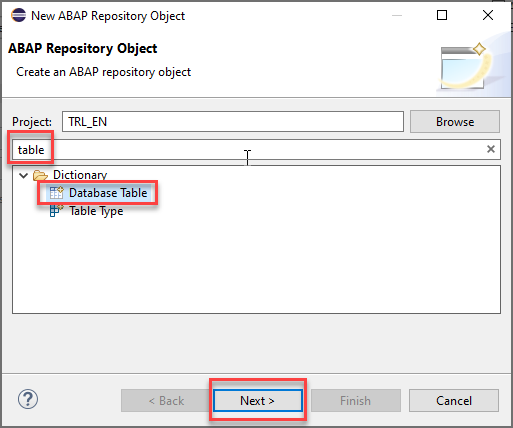
   
   3. Maintain the required information (`###` is your group ID) and click **Next >**.
      - Name: **`ZRAP620_INVEN###`**
      - Description: _**`Inventory data ###`**_                  
             
      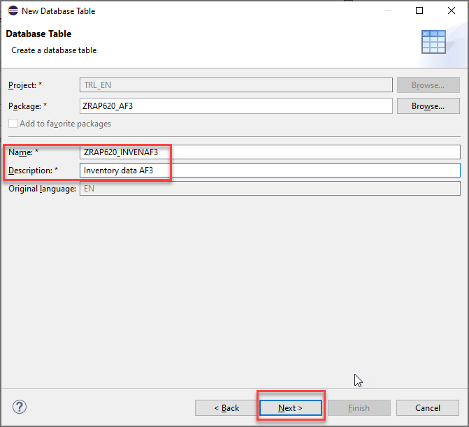
   
   4. Select a transport request, and click **Finish** to create the database table.
   
      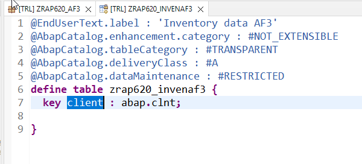

   5. Replace the default code with the code snippet provided below and replace all occurences of the placeholder **`###`** with your group ID using the **Replace All** function (**Ctrl+F**).

         

    
<pre> 
@EndUserText.label : 'Inventory data ###'
@AbapCatalog.enhancement.category : #NOT_EXTENSIBLE
@AbapCatalog.tableCategory : #TRANSPARENT
@AbapCatalog.deliveryClass : #A
@AbapCatalog.dataMaintenance : #RESTRICTED
define table zrap620_inven### {
  key client : abap.clnt not null;
  key uuid              : SYSUUID_X16 not null;
  inventory_id          : abap.char(6);
  product_id            : abap.char(20);
  @Semantics.quantity.unitOfMeasure : 'zrap620_inven###.quantity_unit'
  quantity              : abap.quan(13,3);
  quantity_unit         : abap.unit(3);
  @Semantics.amount.currencyCode : 'zrap620_inven###.currency_code'
  price                  : abap.curr(15,2);
  currency_code         : abap.cuky;
  description           : abap.char(255);
  overall_status        : abap.char(1);
  created_by            : abp_creation_user;
  created_at            : abp_creation_tstmpl;
  last_changed_by       : abp_locinst_lastchange_user;
  last_changed_at       : abp_locinst_lastchange_tstmpl;
  local_last_changed_at : abp_lastchange_tstmpl;

}
</pre>


     

   6. Save  and activate  the changes.
   
</details>


## Exercise 1.3: Generate the transactional UI services
[^Top of page](#)

> Create your OData v4 based UI services with the built-in ADT generator.   
> The generated business service will be transactional, draft-enabled, and enriched with UI semantics for the generation of the Fiori elements app.
> Though we have to adapt the generated code afterwards (which we will do in [Exercise 1.5](#exercise-14-adapt-the-metadata-extension-file) most of the boiler plate coding is being generated for your convenience.)

  <details>
  <summary>Click to expand!</summary>

   1. Right-click your database table  **`zrap620_inven###`**  and select **Generate ABAP Repository Objects** from the context menu.  
  
      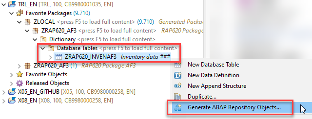
   
   2. Maintain the required information  (`###` is your group ID) and click **Next >**:
        - Description: **`Inventory App ###`**
        - Generator: **`ABAP RESTful Application Programming Model: UI Service`**
        
        
        
   3. Maintain the required information on the **Configure Generator** dialog to provide the name of your data model and generate them.         
      
      For that, navigate through the wizard tree (_Business Objects_, _Data Model_, etc...), maintain the artefact names provided in the table below, 
      and press **Next >**.
 
      
 
      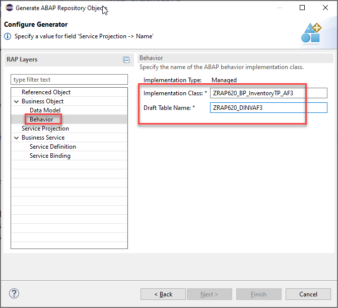
 

        > **Please note**:   
        > If you receive an error message _**Invalid XML format of the response**_, 
        > this may be due to a bug in version 1.26 of the ADT tools.  
        > An update of your ADT plugin to version 1.26.3 will fix this issue.

      
      | **RAP Layer**          |  **Artefacts**           | **Artefact Names**                                       |     
      |:---------------------- |:------------------------ |:-------------------------------------------------------- |
      | **Business Object**    |                          |                                                          |                        
      |                        |  **Data Model**          |  Data Definition Name:   **`ZRAP620_R_InventoryTP_###`**    |
      |                        |                          |  Alias Name:             **`Inventory`**                    |   
      |                        |  **Behavior**            |  Implementation Class:   **`ZRAP620_BP_InventoryTP_###`**   |
      |                        |                          |  Draft Table Name:       **`ZRAP620_DINV###`**          |
      | **Service Projection** (BO Projection)  |         |  Name:                   **`ZRAP620_C_InventoryTP_###`**    |   
      | **Business Services**  |                          |                                                          |          
      |                        |  **Service Definition**  |  Name:         **`ZRAP620_UI_Inventory_###`**               |
      |                        |  **⚠ Service Binding**     |  **⚠** Name:         **`ZRAP620_UI_Inventor_O4_###`**            |
      |                        |                          |  Binding Type: **`OData V4 - UI`**                       |
                       

   
   > **⚠** Please note:  
   > In the repository object name for the service binding we had to shorten the string **`Inventory`** to **`Inventor`** due to the maximum length that is allowed.

   4. Verify the maintained entries and press **Next >** to confirm. 
 
      
 
   5. Select a suitable transport request (1) and press **Finish** (2). The needed artifacts will be generated (3).  
 
      
      

   6. Go to the **Project Explorer**, select your package  **`ZRAP620_###`**, refresh it by pressing **F5**, and check all generated ABAP repository objects 

       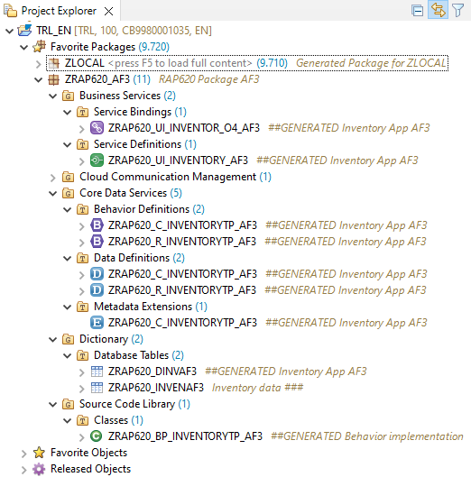
      
   Below is a brief explanation of the generated artefacts for the different RAP layers: Base BO, BO Projection, and Business Service.

---
  **Base Business Object (BO) `ZRAP620_R_Inventory_###`** 
  
   | **Object Name**               |  **Description**         |     
   |:----------------------------- |:------------------------ |
   | **`ZRAP620_R_InventoryTP_###`**     | (aka _Base BO view_): This **data definition** defines the data model of the root entity _Inventory_ which is the only  node of our business object).  |                      
   | **`ZRAP620_R_InventoryTP_###`**   | (aka _Base BO behavior**): This **behavior definition** contains the definition of the standard transactional behavior of the base _Inventory_ BO entity. It is a _managed_ and _draft-enabled_ implementation.  |  
   | **`ZRAP620_DINVE###`**   | (aka _Draft table_): This **database table** is used to temporary store the data from draft _travel_ instances at runtime. It is managed by the RAP framework.    |     
   | **`ZRAP620_BP_InventoryTP_###`**  | (aka _Behavior pool_): This **ABAP class** which provides the implementation of the behavior defined in the behavior definition `ZRAP620_R_InventoryTP_###` of the base _Inventory_ BO.   |  
  
---
  **BO Projection `ZRAP620_C_Inventory_###`** 
  
  The BO projection represents the consumption specific view on the BO data model and behavior. 

   | **Object Name**               |  **Description**         |     
   |:----------------------------- |:------------------------ |
   | **`ZRAP620_C_InventoryTP_###`**   | (aka _BO projection view_): This **data definition** is used to define the projected data model of the root entity _Travel_ relevant for the present scenario. Currently almost all fields of the underlying base BO view are exposed and the definition of metadata extension is allowed using the view annotations `@Metadata.allowExtensions: true`.  |           
   | **`ZRAP620_C_InventoryTP_###`**   | (aka _BO behavior projection_): This **behavior definition** exposes the part of the underlying base _Travel_ BO entity which is relevant for the present scenario with the keyword **`use`**. Currently all standard CUD operations are exposed.  |        
   | **`ZRAP620_C_InventoryTP_###`**   | This **metadata extension** is used to annotate view `ZRAP620_C_InventoryTP_###` and its elements with UI semantics via CDS annotations. |        
   
---
  **Business Service** 

   | **Object Name**               |  **Description**         |     
   |:----------------------------- |:------------------------ |
   | **`ZRAP620_UI_Inventory_###`**  | A service definition is used to define the relevant entity sets for our service and also to provide local aliases if needed. Only the _Inventory_ entity set is exposed in the present scenario. |                      
   | **`ZRAP620_UI_Inventor_O4_###`**  | This service binding is used to expose the generated service definition as OData V4 based UI service. Other binding types (protocols and scenarios) are supported in the service binding wizard.  |  
   
---
 </details>


## Exercise 1.4: Preview the Inventory App
[^Top of page](#)

> Publish the local service endpoint of your service binding  **`ZRAP620_UI_INVENTOR_O4_###`** and start the _Fiori elements App Preview_.

 <details>
  <summary>Click to expand!</summary>

   1. Open your service binding  **`ZRAP620_UI_INVENTOR_O4_###`** and click **Publish**.

      > Since several repository objects are being generated through this actions this can take some time.   

      
   
   2. Double-click on the entity **`Inventory`** in the **Entity Set and Association** section to open the _Fiori elements App Preview_.
     
        
   
   3. Press the **Go** button.
   
   When you click the **Go** button off your_Inventory_ app you will notice that nothing is being displayed because no inventory data has been created yet. You will get the hint  
   
   _No data found. Try adjusting search or filter criteria._   

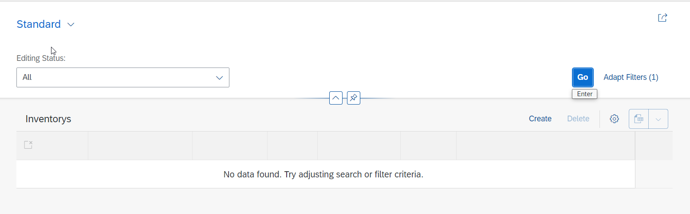  

       
   4. Press the **Create** button.

      Using the create button we can in principle create data without performing any additional implementations. 
      However as you can see there are no descriptions for the fields available yet which would tell you where to enter what.    
      This is because we have used ABAP internal data types such as ````abap.char(8)```` rather than data elements.  
      We will fix this by providing appropriate ````@UI.lineitem.label```` and ````@UI.identification.label```` annotations in the following exercise  **[Exercise 2: Adapt the generated code](../ex2/README.md)**.  
      In this exercise we will also implement a determination that calculates a semantic key for the **InventoryID** and we will add value helps for the currency codes and unit of measures.   

      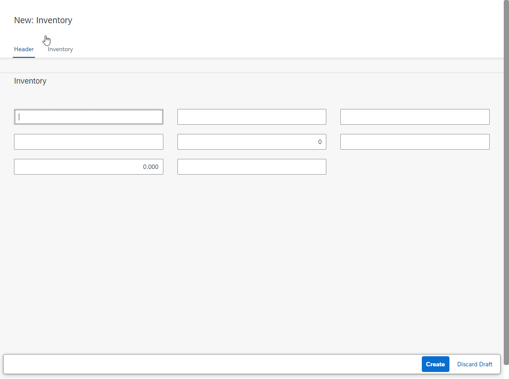

</details>

## Summary 
[^Top of page](#)

Now that you've... 
- created an ABAP package,
- created a database table to store inventory data,
- created a transactional UI service,
- published a local service point, and started the _Fiori elements App Preview_ in ADT,

you can continue with the next exercise - **[Exercise 2: Adapt the generated code](../ex2/README.md/#adapt-the-generated-code)**.

---

## Appendix
[^Top of page](#)

Find the source code for the database table definition and the data generator class in the [sources](sources) folder. Don't forget to replace all occurences of the placeholder `###` with your group ID.

-  [Table ZRAP620_INV###](sources/zrap620_invenXXX.txt)   

