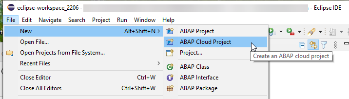
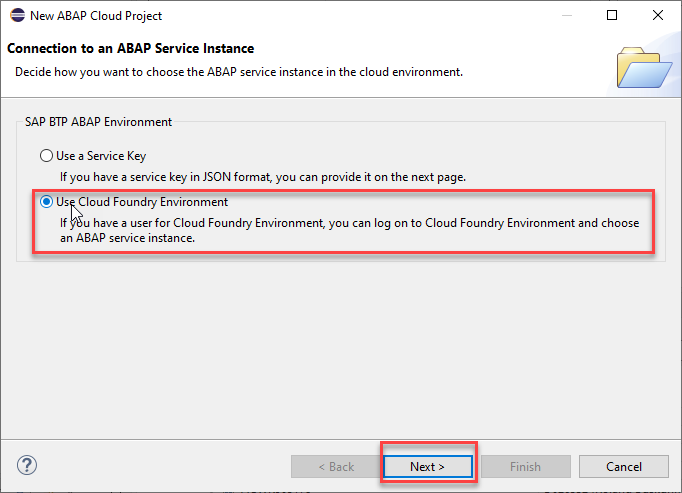
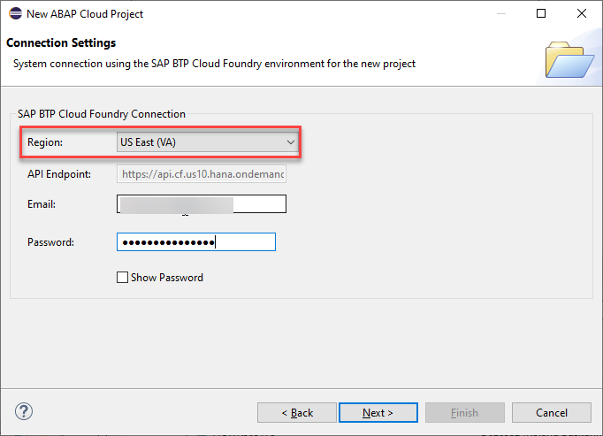
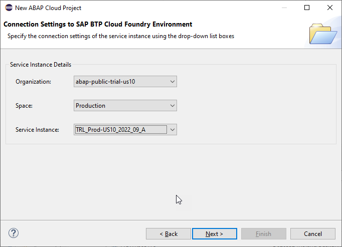
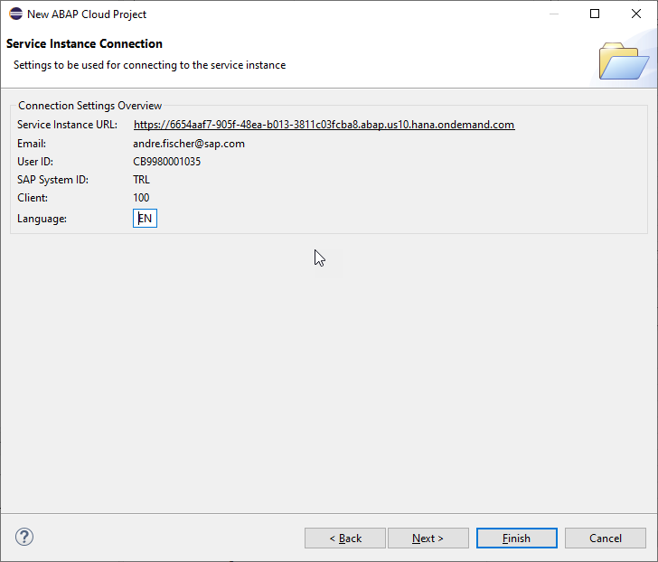

# TOC
[Home](../../README.md#exercises)  
### ABAP Development Tools (ADT)
In order to participate in this hands-on session, you MUST have installed the latest version of Eclipse and the latest version of the ABAP Development Tools (ADT) in Eclipse. Please check the following two short documents how to do this if you have not already done it:     
   - [Install the ABAP Development Tools (ADT)](https://github.com/SAP-samples/abap-platform-rap-workshops/blob/main/requirements_rap_workshops.md#3-install-the-abap-development-tools-adt)  
   - [Adapt the Web Browser settings in your ADT installation](https://github.com/SAP-samples/abap-platform-rap-workshops/blob/main/requirements_rap_workshops.md#4-adapt-the-web-browser-settings-in-your-adt-installation)   

### SAP BTP Trial Account

You also need a user on an SAP BTP, ABAP Environment system. For this tutorial you can use the free trial offering of SAP Business Technology Platform (BTP) 

- You have created a trial account on SAP Cloud Platform: [Get a Free Trial Account on SAP BTP](https://developers.sap.com/tutorials/hcp-create-trial-account.html).
- You have prepared your ABAP Trial which can be easily be done via the [SAP BTP cockpit](https://cockpit.hanatrial.ondemand.com) in just 3 steps.
                                                                                           
  - Click on **Go To Your Trial Account**.
  
  - Click on **Boosters** in the menu on the left hand side
  - Choose the tile **Prepare an Account for ABAP Trial** and follow the wizard
  

  For a detailed step-by-step description check out our [Onboarding Tutorial](https://help.sap.com/viewer/65de2977205c403bbc107264b8eccf4b/Cloud/en-US/720c423ef1a8498ab690cf0e5512ba50.html#loio720c423ef1a8498ab690cf0e5512ba50__Create_ABAP_Trial_Instance).

> **Note for participants of SAP events:** You will recieve logon information from the SAP team during the event. 

### Connect ADT to Steampunk

1. In ADT, from the menue select **New** > **ABAP Cloud Project**. 

      This will open the *New ABAP Cloud Project* wizard.  
 
      
   
   2. In the first screen *Connection to an ABAP Service Instance* 
       - Select the radio button **Use Cloud Foundry Environment**.   
       - Click **Next**   
 
      
   
   3. Maintain the required information in the screen *Connection settings*:  
       - Region: **US East (VA)** 
       - EMail: Enter the email adress you used to authenticate at SAP BTP trial  
       - Password: Enter the password you used to authenticat at SAP BTP trial 
       - Click **Next**
     
 
         
 
 
   > As a result a new ABAP cloud project will be opened.
 
 
 
   4. In the screen **Connection Settings to SAP BTP Cloud Foundry Environment** default values will be selected.   
 
 
        
 
 
       Press **Next >**
 
   5. In the **Logon to the SAP Cloud System**  press the button **Open Logon Page in Browser**. This will open the default browser that is configured in ADT. If needed enter your credentials to log on to the SAP BTP platform. When you have just logged on to create the trial ABAP Environment instance you will be automatically authenticated.  
 
 
          
 
 
   6. In the **Service Instance Connection** screen just press **Finish**. 
 
 
          
 
