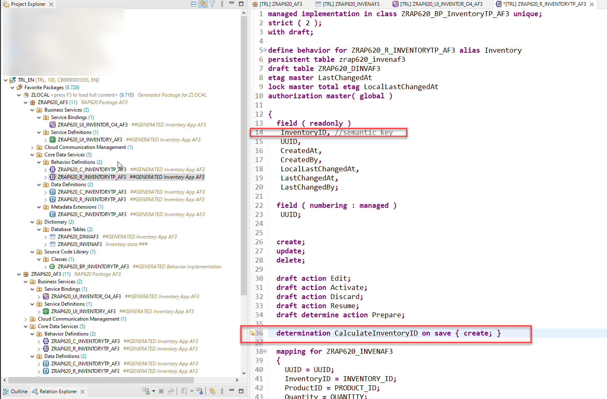
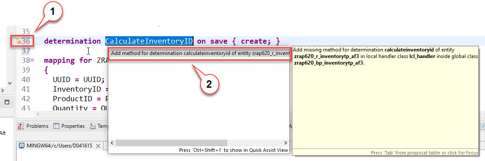
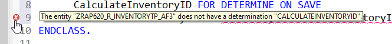
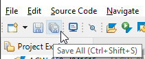
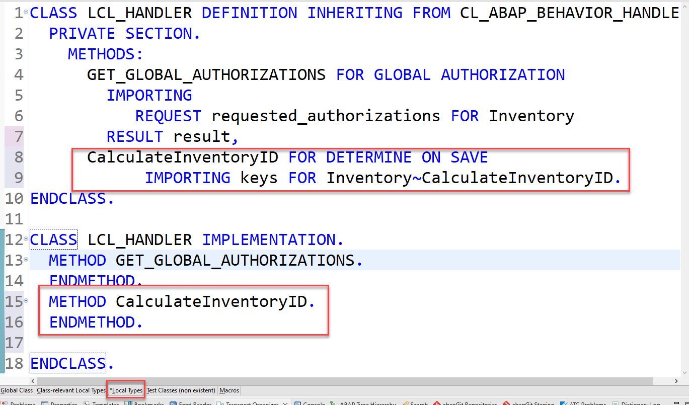
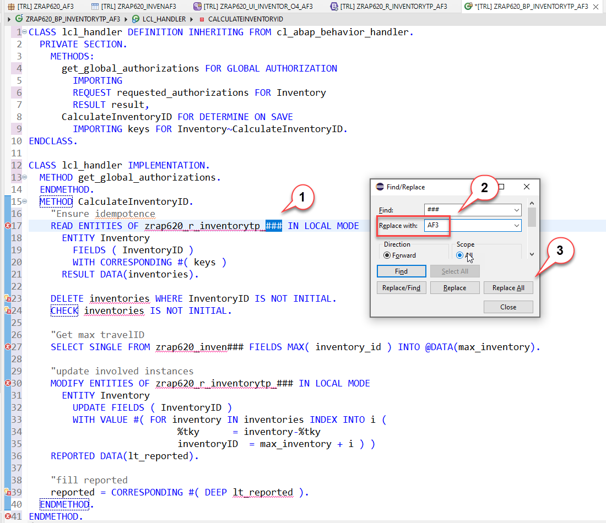
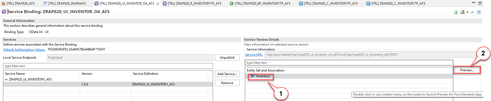
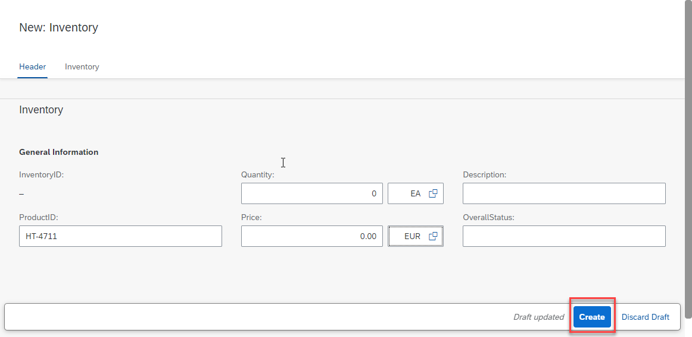
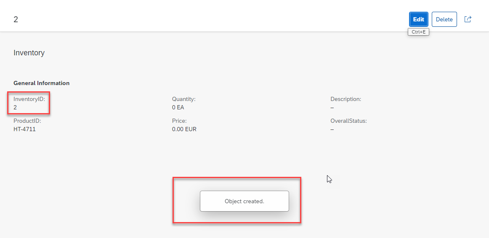

# TOC
[Home](../../readme.md#exercises)
# Adapt the generated code

In this exercise we will perform changes to the generated code so that our application becomes usable. 

- _Projection view_:  
Here we will add value help definitions for the currency code and quantity units.

- _Metadata extension file_:  
Since we use built-in ABAP data types rather than data elements we have to add UI annotations to provide a label for the columns in the list view and the fields in the object page.

- _Behavior Definition_ and _Behavior Implementation_:  
Here we will make the semantic key field **InventoryID** _read_only_ and we will add a determination to the behavior definition and implement the same in the behavior implementation clas so that the semantic key field **InventoryID** will be filled automatically.

## Projection view

In the source code of the projection view ````ZRAP620_C_INVENTORYTP_### ```` we will add two value help definitions for the fields ````QuantityUnit```` and ````CurrencyCode````. 

You can either open the source code editor from the Project Explorer or you can use the short cut **Ctrl+Shift+A**  which starts the dialogue to open an ABAP development object and search for ````ZRAP620_C_INVENTORYTP_### ````.   
 <details>
  <summary>Click to expand the source code ...</summary>
<pre lang="ABAP">
@AccessControl.authorizationCheck: #CHECK
@Metadata.allowExtensions: true
@EndUserText.label: 'Projection TEST BUG View for ZRAP620_R_INVENTORYTP_###'
define root view entity ZRAP620_C_INVENTORYTP_###
  provider contract transactional_query
  as projection on ZRAP620_R_INVENTORYTP_###
{
  key UUID,
      InventoryID,
      ProductID,
      Quantity,
      @Consumption.valueHelpDefinition: [ {
      entity: {
        name: 'I_UnitOfMeasure',
        element: 'UnitOfMeasure'
      }
      } ]
      QuantityUnit,
      Price,
      @Consumption.valueHelpDefinition: [ {
      entity: {
        name: 'I_Currency',
        element: 'Currency'
      }
      } ]
      CurrencyCode,
      Description,
      OverallStatus,
      LastChangedAt

}


</pre>
</details>

## Metadata extension file

Open the metadata extension file ````ZRAP620_C_INVENTORYTP_### ````. Replace the complete source code with the following code snippet and use search and replace to change the placeholder ````###````.

 <details>
  <summary>Click to expand the source code ...</summary>
<pre>
@Metadata.layer: #CUSTOMER
@UI: {
  headerInfo: {
    typeName: 'Inventory', 
    typeNamePlural: 'Inventorys', 
    title: {
      type: #STANDARD, 
      label: 'Inventory', 
      value: 'InventoryID'
    }
  }, 
  presentationVariant: [ {
    sortOrder: [ {
      by: 'InventoryID', 
      direction: #DESC
    } ], 
    visualizations: [ {
      type: #AS_LINEITEM
    } ]
  } ]
}
annotate view ZRAP620_C_INVENTORYTP_### with
{
  @UI.facet: [ {
    id: 'idCollection', 
    type: #COLLECTION, 
    label: 'Inventory', 
    position: 10 
  }, 
  {
    id: 'idIdentification', 
    parentId: 'idCollection', 
    type: #IDENTIFICATION_REFERENCE, 
    label: 'General Information', 
    position: 10 
  } ]
  @UI.hidden: true
  UUID;
  
  @UI.lineItem: [ {
    position: 20 , 
    importance: #HIGH, 
    label: 'InventoryID'
  } ]
  @UI.identification: [ {
    position: 20, 
    label: 'InventoryID'
  } ]
  @UI.selectionField: [ {
    position: 20 
  } ]
  InventoryID;
  
  @UI.lineItem: [ {
    position: 30 , 
    importance: #HIGH, 
    label: 'ProductID'
  } ]
  @UI.identification: [ {
    position: 30 , 
    label: 'ProductID'
  } ]
  ProductID;
  
  @UI.lineItem: [ {
    position: 40 , 
    importance: #HIGH, 
    label: 'Quantity'
  } ]
  @UI.identification: [ {
    position: 40 , 
    label: 'Quantity'
  } ]
  Quantity;
  
  @UI.selectionField: [ {
    position: 50 
  } ]
  QuantityUnit;
  
  @UI.lineItem: [ {
    position: 60 , 
    importance: #HIGH, 
    label: 'Price'
  } ]
  @UI.identification: [ {
    position: 60 , 
    label: 'Price'
  } ]
  Price;
  
  @UI.selectionField: [ {
    position: 70 
  } ]
  CurrencyCode;
  
  @UI.lineItem: [ {
    position: 80 , 
    importance: #HIGH, 
    label: 'Description'
  } ]
  @UI.identification: [ {
    position: 80 , 
    label: 'Description'
  } ]
  Description;
  
  @UI.lineItem: [ {
    position: 90 , 
    importance: #HIGH, 
    label: 'OverallStatus'
  } ]
  @UI.identification: [ {
    position: 90 , 
    label: 'OverallStatus'
  } ]
  OverallStatus;
  
  @UI.hidden: true
  createdby;
  
  @UI.hidden: true
  createdat;
  
  @UI.lineItem: [ {
    position: 120 , 
    importance: #HIGH
  } ]
  @UI.identification: [ {
    position: 120 
  } ]
  lastchangedby;
  
  @UI.hidden: true
  LastChangedAt;
  
  @UI.hidden: true
  locallastchangedat;
}
</pre>
</details>

## Behavior definition

Open the behavior defintion ````ZRAP620_R_INVENTORYTP_### ```` and add the field **InventoryID** to the list of fields that are marked as readonly and add a determination **CalculateInventoryID** for the field **InventoryID**.

<details>
  <summary>Click to expand the steps ...</summary>

1. Add **InventoryID** to the list of read-only fields:

<pre>
 field ( readonly )
  InventoryID, //semantic key
  UUID,
  CreatedAt,
  CreatedBy,
  LocalLastChangedAt,
  LastChangedAt,
  LastChangedBy;

</pre>


2. add the following line of code right before the mapping section.

<pre>
determination CalculateInventoryID on save { create; }
</pre>

> Once you have added the determination to the behavior definition you will get a warning that the determination is not implemented yet.


   

3. Click on the warning icon 

4. Choose the quick fix **add method for determination caculateinventoryid of entity ZRAP620_R_INVENTORYTP_###**  

   
   

5. The editor for the behavior implementation class opens and you will see the warning _The entity "ZRAP620_R_INVENTORYTP_AF3" does not have a determination "CALCULATEINVENTORYID"._

   

6. Press Save all.

   > This will save the behavior definition as well as the behavior implementationand it will remove the error message in the behavior implementation class. 

   
   

7. Activate your changes.   

</details>

## Behavior implementation

The behavior implementation class ````ZRAP620_BP_INVENTORYTP_###```` is automatically opened with the tab **Local Types** for the local handler class ````lcl_handler```` .
The quick fix has added a method ````CalculateInventoryID```` with an (empty) implementation for the determination that shall calculate the semantic key InventoryID. 

<details>
  <summary>Click to expand the steps ...</summary>

 

1. Add the code shown below to implement the determination for the field **InventoryID**
  
> The implementation of the behavior defintion must (for technical reasons) take place in local classes that follow the naming convention **lhc_handler** when being generated with the wizard and **lhc_\<EntityName\>** (here **lhc_Inventory**) if being generated by ADT using a quick fix.  
> We suggest to use the source code shown below to implement the calculation of the semantic key of our managed business object for inventory data. In a productive application you would rather use a number range.  
> To keep our implementation simple we will use the approach to simply count the number of objects that are available.   
> By a simple increment of this number we get a semantic key which is readable by the users of our application.


 <pre lang="ABAP"> 
 
METHOD CalculateInventoryID.

    "Ensure idempotence
    READ ENTITIES OF zrap620_r_inventorytp_### IN LOCAL MODE
      ENTITY Inventory
        FIELDS ( InventoryID )
        WITH CORRESPONDING #( keys )
      RESULT DATA(inventories).

    DELETE inventories WHERE InventoryID IS NOT INITIAL.
    CHECK inventories IS NOT INITIAL.

    "Get max travelID
    SELECT SINGLE FROM zrap620_inven### FIELDS MAX( inventory_id ) INTO @DATA(max_inventory).

    "update involved instances
    MODIFY ENTITIES OF zrap620_r_inventorytp_### IN LOCAL MODE
      ENTITY Inventory
        UPDATE FIELDS ( InventoryID )
        WITH VALUE #( FOR inventory IN inventories INDEX INTO i (
                           %tky      = inventory-%tky
                           inventoryID  = max_inventory + i ) )
    REPORTED DATA(lt_reported).

    "fill reported
    reported = CORRESPONDING #( DEEP lt_reported ).
  ENDMETHOD.

ENDMETHOD.
 
</pre>
   
 7. Replace the placeholders <b>####</b> with your group number **(Ctrl+F)**.
 
 8. Activate your changes **(Ctrl+F3)**

 

</details>

# Test your changes

After having performed all the changes mentioned above we can use the SAP Fiori Elements preview in ADT to test our updated implementation.   

<details>
  <summary>Click to expand the steps ...</summary>

1. Open the service binding **`ZRAP620_UI_INVENTOR_O4_###`**
2. Start the SAP Fiori elements preview.
   - Select the entity set **Inventory**  
   - Press the **Preview** button 

   

3. Test the implementation. 
  - Press the **Create** button.
  - Enter an arbritray product name
  - Press **Create**
  
    
    
  
2. Check the numbering for the semantic key **InventoryID**.

 
   

</details>
