# TOC
[Home](../../readme.md#exercises)
# Exercise 3: Consume a remote API based on an OData service

## Introduction

In this exercise you will learn how to consume an OData Service from an on premise system.
The data will be used to build a value help to fetch product master data for the Inventory entity.

<span style="color:red">
**Caution:
Creating a service consumption model currently fails in the SAP BTP ABAP Trial systems. A fix will be imported with the next Hotfix Collection that is planned to be imported on December 23rd.**
</span>

In this exercise, you will ...

- [Create a Service Consumption Model for the on premise OData Service](#create-the-service-consumption-model)

- [Create a console application to test the OData Service call](#create-a-console-application-to-test-the-odata-service)

- [Create a custom entity and implement the query implementation class](#create-a-custom-entity-and-implement-the-query-implementation-class)
  - [Create a custom entity](#create-a-custom-entity)
  - [Implement the query implemenation class](#implement-the-query-implemenation-class-zrap260ceproducts)   

- [Add the custom entity as a value help](#add-the-custom-entity-as-a-value-help)
- [Test the service](#test-the-service)
- [Summary](#summary) 


When creating a new entry with your inventory application you see that there is no value help for the field **ProductId**. 
Since this information resides in a SAP S/4 HANA backend we will retrieve it retrieve via OData.

 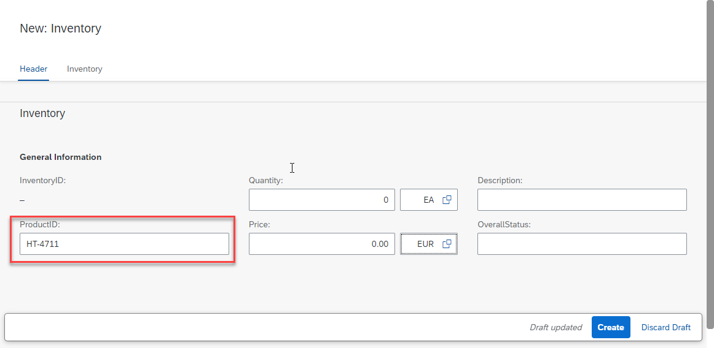


> **Please note:**

> Since it must be possible to run this demo on the trial systems which are shared systems we  have to use services that are publically available in the Internet and that do not require any authentication. 
In our demo we will thus use an OData Service that is available in the SAP Gateway Demo System ES5 and that does not require any authentication.  
> From an implementation perspective this means that a slightly different coding will be used opposed to an implementation that you would use in a productive system.


## Create the Service Consumption Model
[^Top of page](#)  

In this step we will generate a so called **Service Consumption Model**. This type of object takes an external interface description as its input. Currently *OData*, *SOAP* and *RFC* are supported.   
Based on the information found in the *$metadata* file or the *wsdl* file appropriate repository objects are generated (OData Client proxy or SOAP proxy objects). For RFC function modules the metadata file is created in the backend using the transaction *ACO_PROXY*.  
Using these objects you will be able to write ABAP code that lets you consume remote OData services, SOAP services or RFC function modules.

<details>
<summary>Click to expand</summary>

We start by creating a service consumption model for an OData service that provides demo product data. This service resides on the public SAP Gateway System ES5 and does not require any authentication

1. The *$metadata* file of the OData service that we want to consume must be uploaded in file format. You have hence to download it first.
 
 - Click on the following URL https://sapes5.sapdevcenter.com/sap/opu/odata/sap/ZPDCDS_SRV/$metadata

   When you are asked to select a certificate or to authenticate, simply press the **Cancel** button, since this URL does not require any authentication.

   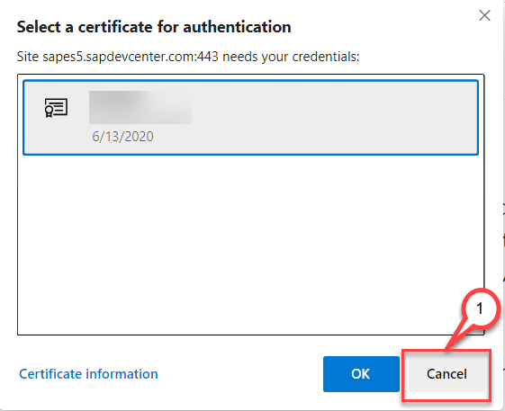  
   
 - Download the $metadata file to your computer, you will need it later in this exercise.  

   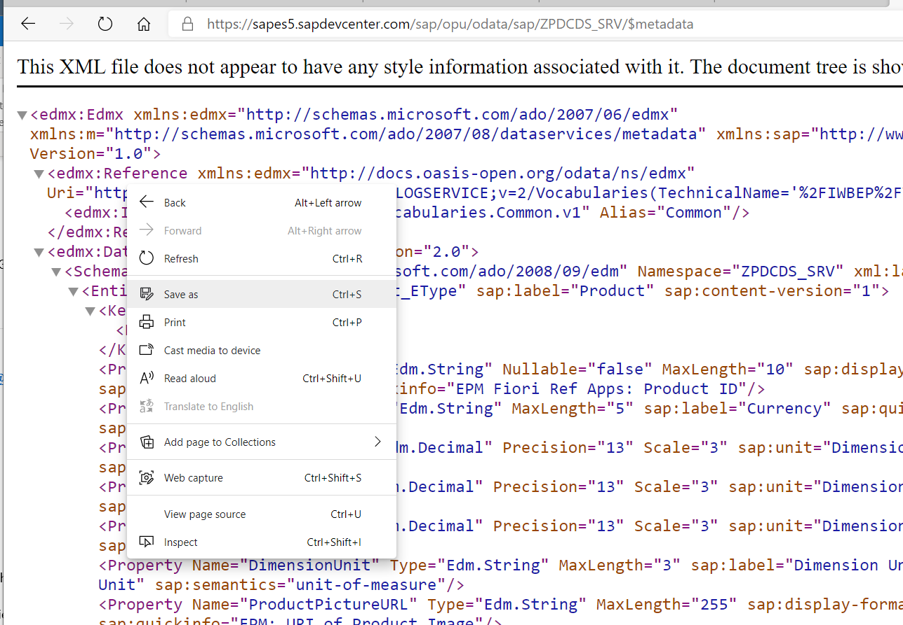  
   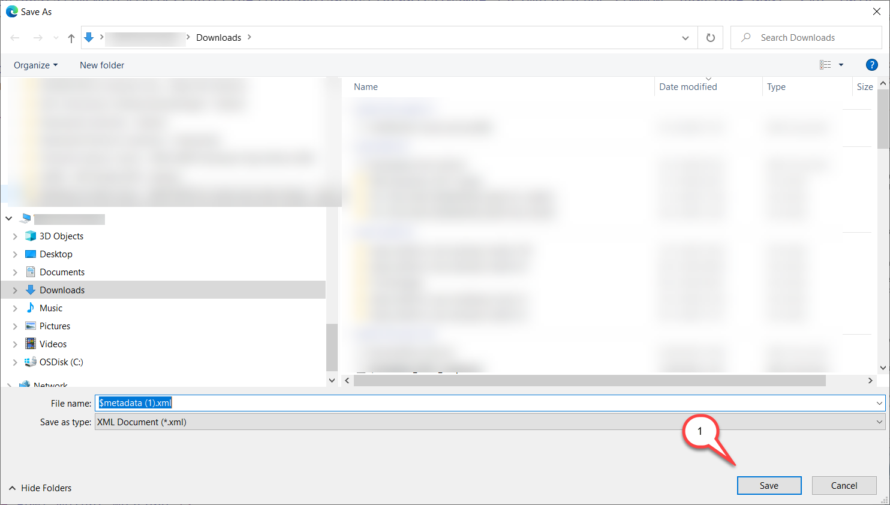  

2. Switch to ADT and right click on your package **ZRAP620_###**. Select **New > Other ABAP Repository Object**.  

      

2. In the New ABAP Repository Object dialogue do the following

   -  Start to type **`Service`**
   -  In the list of objects select **Service Consumption Model**
   -  Click **Next**
 
      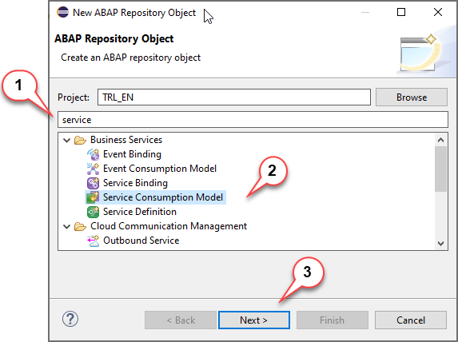

4. The **New Service Consumption Model** dialogue opens. Here enter the following data:

   - Name: **`ZRAP620_SC_PRODUCTS_###`**
   - Description: **`Products from ES5`**
   - Remote Consumption Model: **`OData`** (to be selected from the drop down box)
   
   Then click **Next**. 
   
   > **Caution**
   
   > Be sure that you have selected **`OData`** as the **Remote Consumption Mode** from the drop down box. We will create a service consumption model for a SOAP web service in the following exercise.
   
    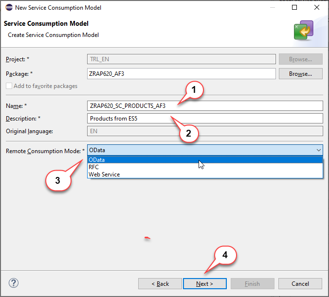

5. The $metadata file of the OData service that we want to consume must be uploaded in file format. If you have not yet downloaded the $metadata file you have to do this now.

   - Click **Browse** to select the $metadata file that you have downloaded earlier in this exercise
   - Prefix: **`RAP620_###`** 

> **Please note**

> The prefix that you have entered will be added to the names of the repository objects that are generated, namely the **abstract entities**.  
> If you don't select a prefix and if the wizard finds out that there would be name clashes the wizard will propse unique names by adding arbitrary characters to the repository object names.  
> In any case you will be able to change the values that will be proposed by this wizard.

 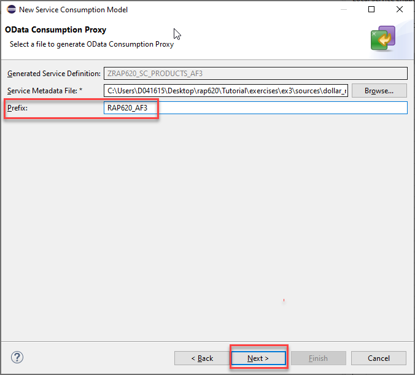

6. Check the **ABAP Artifact Name** and click **Next**.

   You will notice that the name of the ABAP artifact has been set to `ZRAP620_###SEPMRA_I_PRODUCT_E` since we have provided the prefix `RAP620_###`. 

   Press **Next**.

> Additional Information

> If you have not provided a prefix the ABAP Artifact Name might contain several arbritray characters that have been added to the name **ZSEPMRA_I_PRODUCT**. This can happen if other users in the same system have already imported the same $metadata file. In order to avoid name clashes the wizard then adds arbitrary characters so that a unique name for the ABAP artifact is ensured.

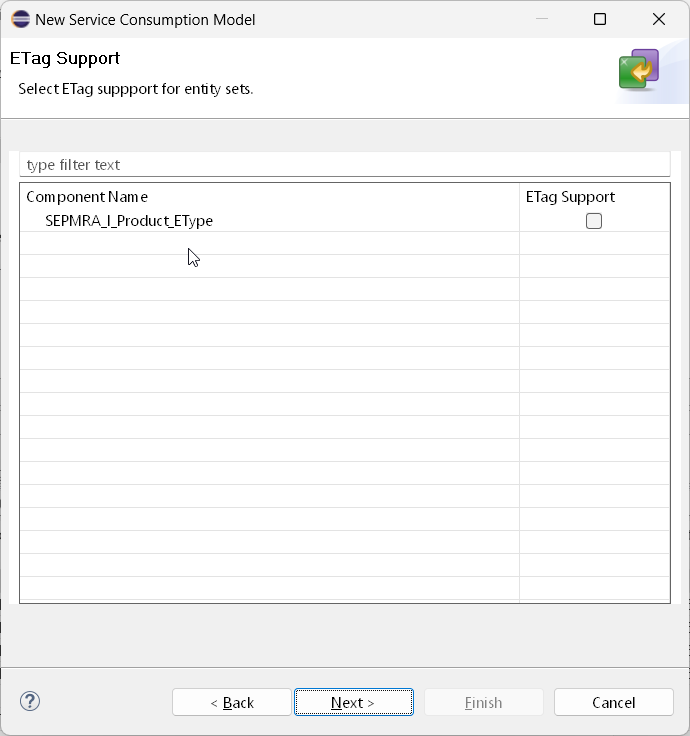

7. The wizard will now list the repository objects that will be generated, namely a service definition and an abstract entity in addition to the service consumption model.

   - Service Definition: **ZRAP620_SC_RAP_PRODUCTS_###**
   - Abstract Entity: **ZRAP620_###SEPMRA_I_PRODUCT_E**

Click **Next**.

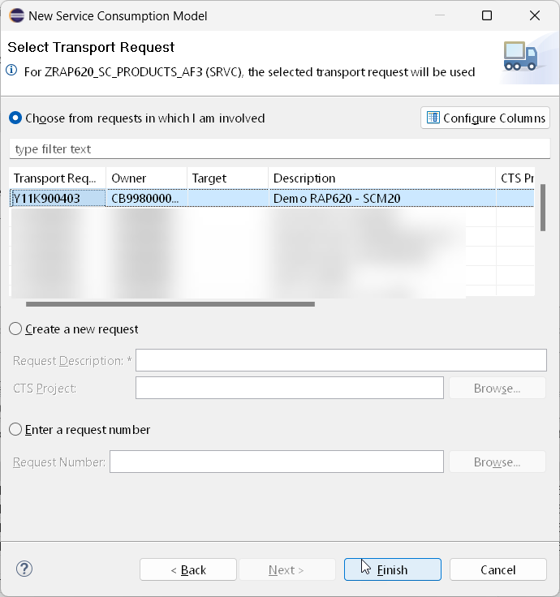

8. Selection of transport request
   - Select or create a transport request
   - Press **Finish**

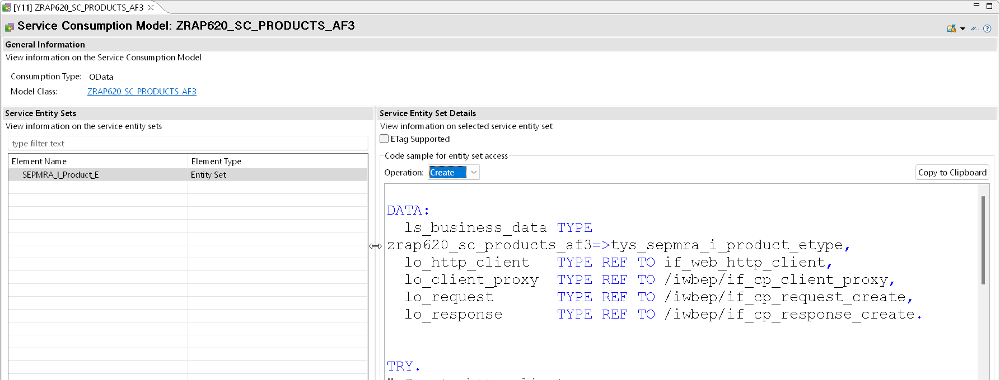

9. Let us briefly investigate the service consumption model.  

   For each operation (**Read List**, **Read**, **Create**, **Update** and **Delete**) some sample code has been created that you can use when you want to call the OData Service with one of these operations. Since we want to retrieve a list of Product-IDs, we will select the operation **Read List** and click on the button **Copy to Clipboard**. We will use this code in the following step where we create a console application to test the call to the remote OData service. 
  
 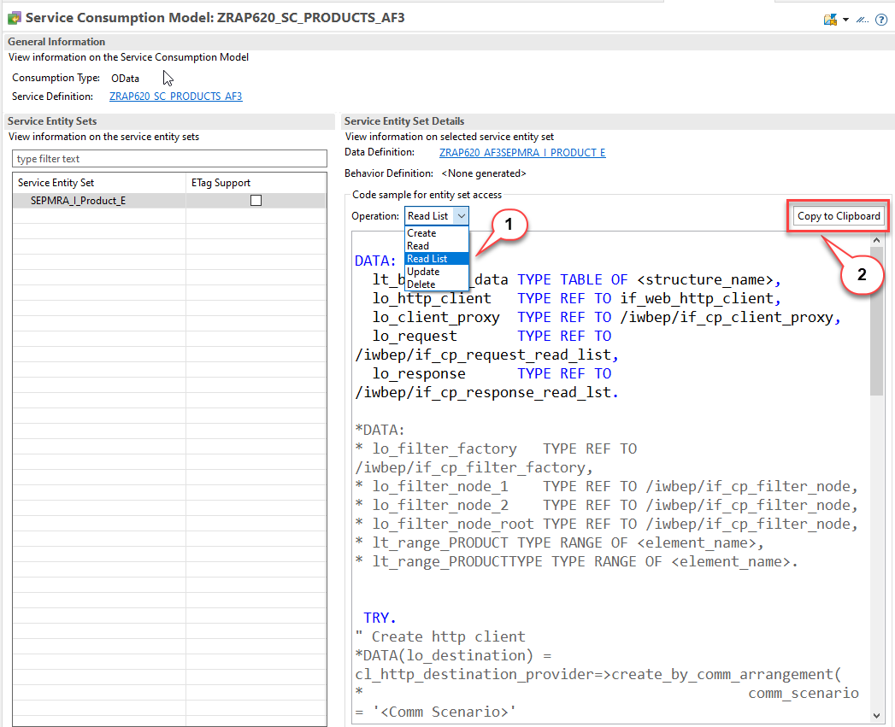 

</details>

## Create a console application to test the OData service
[^Top of page](#)

We can now test the service consumption model by creating a small console application ````ZRAP620_CL_CE_PRODUCTS_###```` that implements the interface ````if_oo_adt_classrun````. 
This is a useful additional step since this way it is easier to check whether the OData consumption works and debugging a console application is much easier than trying out your coding in the full fledged RAP business object.

> **Please note**

> We will use this class at a later stage also as an implementation for our custom query and we hence choose a name ````ZRAP620_CL_CE_PRODUCTS_###```` that already contains the name of the to be created custom entity. ````CE```` denotes that this class will act as a query implementation for a *Custom Entity*.

<details>
<summary>Click to expand</summary>

1. Right click on the folder **Source Code Library** and select **New > ABAP Class**.
   
   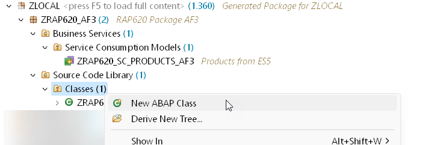

2. The **New ABAP class** dialogue opens. Here you have to enter the following:

   - Name: ````ZRAP620_CL_CE_PRODUCTS_###````
   - Description: ````Query implementation custom entity```` 
   - Click **Add**
   
   The **Add ABAP Interface** dialogue opens.
   
   - Start to type ````if_oo````
   - Select ````IF_OO_ADT_CLASSRUN```` from the list of matching items
   - Press **OK** or double-click on ````IF_OO_ADT_CLASSRUN````
   
   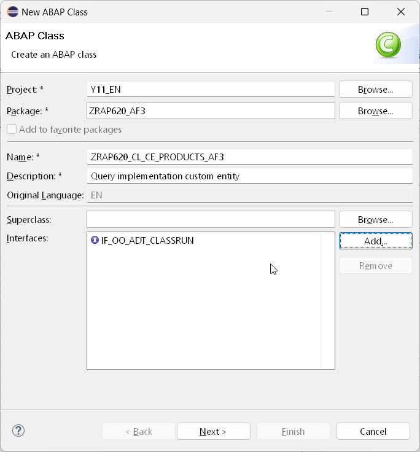
   
   
3. Check the input and press **Next**

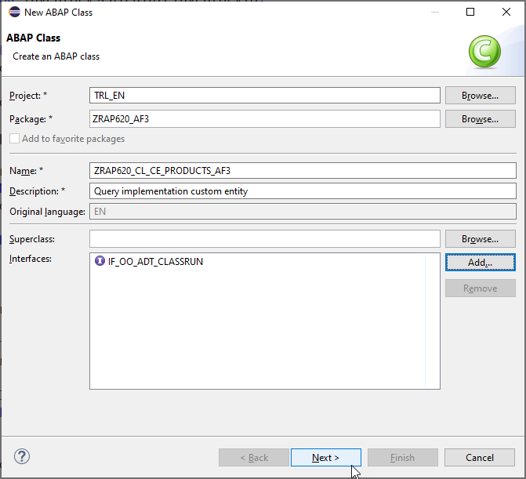

4. Selection of transport request

   - Select or create a transport request
   - Click **Finish**
  
5. Check the source code template

  You will notice that the wizard has automatically added an implementation for the method ````IF_OO_ADT_CLASSRUN~MAIN````. 

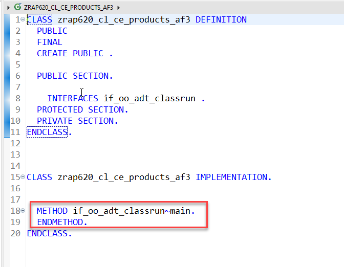

## CLASS ZRAP620_CL_CE_PRODUCTS_### - Implementation
[^Top of page](#)  

1. Let's start with the implementation of our test class. 

   In the public section we add two ````TYPES```` definitions. ````t_product_range```` is used to provide filter conditions for ProductIDs in form of ````SELECT-OPTIONS```` to the method ````get_products( )````.  
   The second type ````t_business_data```` is used to retrieve the business data returned by our remote OData service.  
   The  ````get_products( )```` method takes filter conditions in form of ````SELECT-OPTIONS```` via the importing parameter ````it_filter_cond````. In addition it is possible to provide values for ````top```` and ````skip```` to leverage client side paging.  

   So the ````DEFINITION```` section of your class should now look like follows:

<pre>
CLASS zcl_ce_rap_products_#### DEFINITION
  PUBLIC
  FINAL
  CREATE PUBLIC .

  PUBLIC SECTION.

    INTERFACES if_oo_adt_classrun .

    TYPES t_product_range TYPE RANGE OF zrap620_###sepmra_i_product_e-Product.
    TYPES t_business_data TYPE TABLE OF zrap620_###sepmra_i_product_e.

    METHODS get_products
      IMPORTING
        it_filter_cond   TYPE if_rap_query_filter=>tt_name_range_pairs   OPTIONAL
        top              TYPE i OPTIONAL
        skip             TYPE i OPTIONAL
      EXPORTING
        et_business_data TYPE  t_business_data
      RAISING
        /iwbep/cx_cp_remote
        /iwbep/cx_gateway
        cx_web_http_client_error
        cx_http_dest_provider_error
      .

  PROTECTED SECTION.
  PRIVATE SECTION.
ENDCLASS.
</pre>

   You will get a warning that the method **get_products( )** has not been implemented yet. Press **Ctrl+1** to start the quick fix to add an implementation for **get_products( )**.

   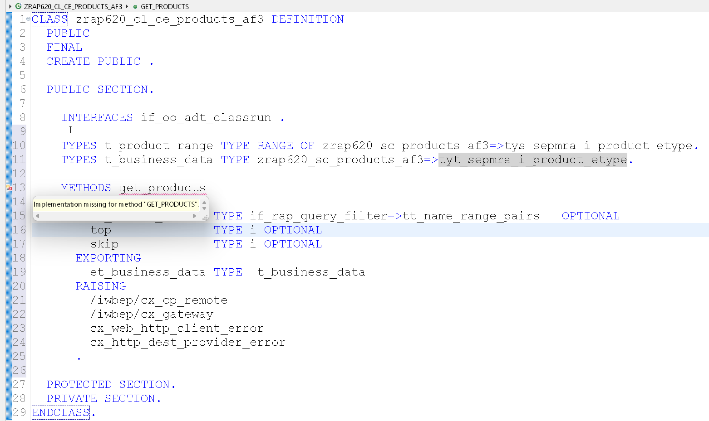

6. Now we will add code in the **IMPLEMENTATION** section of the method **get_products( )**. 

   The public method **get_products( )** is used to retrieve the data from the remote OData service. Since it is not possible to leverage the destination service in the trial systems, we will use the method **cl_http_destination_provider=>create_by_url** which allows us to create a http destination object based on the target URL. As the target URL we choose the root URL https://sapes5.sapdevcenter.com of the ES5 system since the relative URL that points to the OData service will be added when creating the OData client proxy.

   **Caution:**  
   Do not forget to replace the placeholder **'####'** with your unique number.  

   > Please note

   > In a normal SAP BTP, ABAP Environment system one would leverage the destination service of the underlying Cloud Foundry Environment and one would use the statement **cl_http_destination_provider=>create_by_cloud_destination** to generate a http destination in the ABAP Environment system based on these settings.

 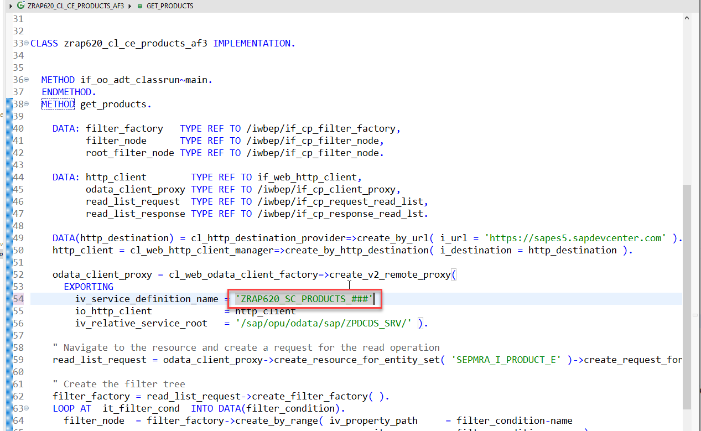

<pre>
  METHOD get_products.

    DATA: filter_factory   TYPE REF TO /iwbep/if_cp_filter_factory,
          filter_node      TYPE REF TO /iwbep/if_cp_filter_node,
          root_filter_node TYPE REF TO /iwbep/if_cp_filter_node.

    DATA: http_client        TYPE REF TO if_web_http_client,
          odata_client_proxy TYPE REF TO /iwbep/if_cp_client_proxy,
          read_list_request  TYPE REF TO /iwbep/if_cp_request_read_list,
          read_list_response TYPE REF TO /iwbep/if_cp_response_read_lst.

    DATA(http_destination) = cl_http_destination_provider=>create_by_url( i_url = 'https://sapes5.sapdevcenter.com' ).
    http_client = cl_web_http_client_manager=>create_by_http_destination( i_destination = http_destination ).

    odata_client_proxy = cl_web_odata_client_factory=>create_v2_remote_proxy(
      EXPORTING
        iv_service_definition_name = 'ZRAP620_SC_PRODUCTS_###'
        io_http_client             = http_client
        iv_relative_service_root   = '/sap/opu/odata/sap/ZPDCDS_SRV/' ).

    " Navigate to the resource and create a request for the read operation
    read_list_request = odata_client_proxy->create_resource_for_entity_set( 'SEPMRA_I_PRODUCT_E' )->create_request_for_read( ).

    " Create the filter tree
    filter_factory = read_list_request->create_filter_factory( ).
    LOOP AT  it_filter_cond  INTO DATA(filter_condition).
      filter_node  = filter_factory->create_by_range( iv_property_path     = filter_condition-name
                                                              it_range     = filter_condition-range ).
      IF root_filter_node IS INITIAL.
        root_filter_node = filter_node.
      ELSE.
        root_filter_node = root_filter_node->and( filter_node ).
      ENDIF.
    ENDLOOP.

    IF root_filter_node IS NOT INITIAL.
      read_list_request->set_filter( root_filter_node ).
    ENDIF.

    IF top > 0 .
      read_list_request->set_top( top ).
    ENDIF.

    read_list_request->set_skip( skip ).

    " Execute the request and retrieve the business data
    read_list_response = read_list_request->execute( ).
    read_list_response->get_business_data( IMPORTING et_business_data = et_business_data ).

  ENDMETHOD.
</pre>

8. Finally we add the following code into the **IMPLEMENTATION** section of your **main** method

  The main method creates a simple filter for products with a name greater or equal **HT-1200**. At the same time we use client side paging to skip the first result and limit the response to 3 products.

<pre>
  METHOD if_oo_adt_classrun~main.

    DATA business_data TYPE TABLE OF zrap620_###sepmra_i_product_e.
    DATA filter_conditions  TYPE if_rap_query_filter=>tt_name_range_pairs .
    DATA ranges_table TYPE if_rap_query_filter=>tt_range_option .
    ranges_table = VALUE #( (  sign = 'I' option = 'GE' low = 'HT-1200' ) ).
    filter_conditions = VALUE #( ( name = 'PRODUCT'  range = ranges_table ) ).

    TRY.
        get_products(
          EXPORTING
            it_filter_cond    = filter_conditions
            top               =  3
            skip              =  1
          IMPORTING
            et_business_data  = business_data
          ) .
        out->write( business_data ).
      CATCH cx_root INTO DATA(exception).
        out->write( cl_message_helper=>get_latest_t100_exception( exception )->if_message~get_longtext( ) ).
    ENDTRY.

  ENDMETHOD.
</pre>


9. The code should now look as follows

   [Source code zcl_ce_rap_products_####](sources/ex2_CLAS_zcl_ce_rap_products_%23%23%23%23_step_1.txt)

10. You can now run the console application by pressing **F9**.


    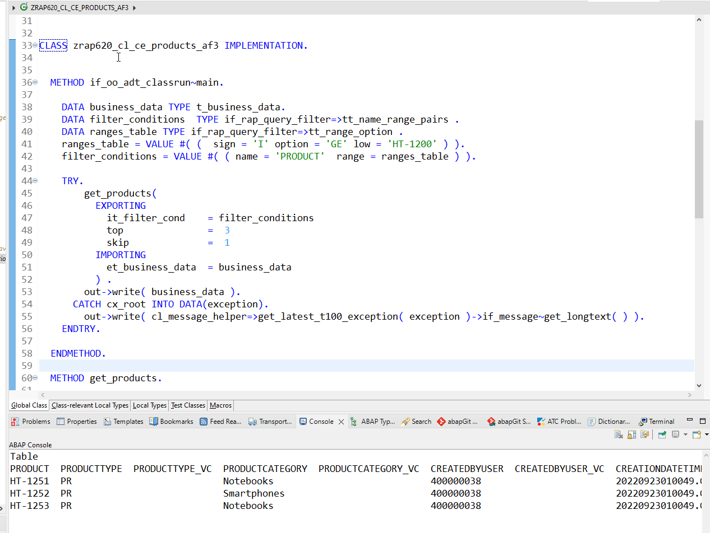

</details>

## Create a custom entity and implement the query implementation class
[^Top of page](#)

Since we want to use the results of the remote OData service in our managed inventory app we will create a custom entity. 
The syntax of a custom entity differs from the one used in normal CDS views but is very similar to the syntax of an abstract entity and we can thus reuse most of the DDL source code of the abstract entity that has been generated when the service consumption model was created.

In order to leverage the remote OData service in our application we have to perform two steps.

1.	We have to create a custom entity. 
2.	We have to create a class that implements the query for the custom entity. (Here we will reuse the class that we have created earlier and that we have used to test the remote OData service).

<details>
<summary>Click to expand</summary>

### Create a custom entity
[^Top of page](#)

In contrast to "normal" CDS views that read data from the database from tables or other CDS views _custom entities_ act as a wrapper for a code based implementation that provides the data instead of a database table or a CDS view. 

The custom entity has to be created manually and it uses a similar syntax as the abstract entity that has been created when we have created our service consumption model.

In order to be able to retrieve the data from the remote OData service we have to built a class that implements the interface **if_rap_query_provider**. We will reuse the class that we have created earlier and add this interface to it.

The interface **if_rap_query_provider interface** only offers one method which is called **select**. Within this select method we will call the public **get_products( )** method. The select method also expects that the incoming requests provide certain OData specific query parameters. These we will set in our coding as well.

Let’s start with creating a new data definition ````ZRAP620_CE_PRODUCTS_###```` using the template for a custom entity.

1. Right-click on the folder **Data Definition** and select **New Data Definition.**   

   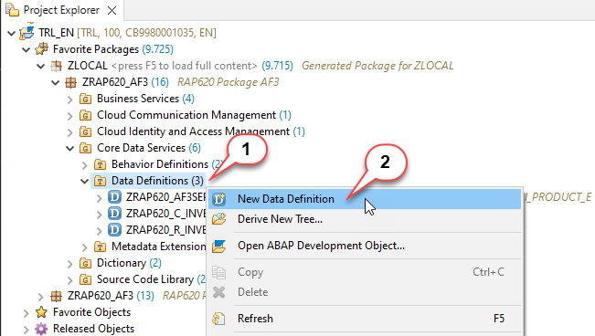

2. The **New Data Defintion** dialogue opens. Here you have to enter the following values:  
   - Name: **`ZRAP260_CE_PRODUCTS_###`** 
   - Description: **`Custom entity for products from ES5`**
   
   Press **Next**
   
   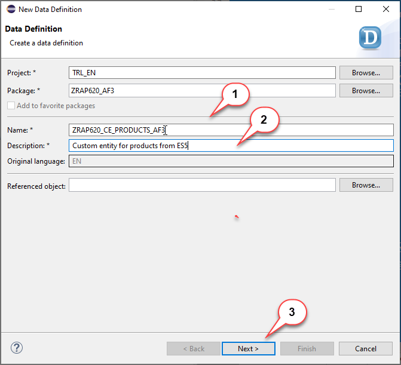
   
3. Selection of a transport request
   - Select or create a transport request.
   - **!!! ONLY !!!** Press *Next*. Do **NOT** press *Finish*.

   > Caution

   > If you were to press **Finish** instead of **Next**, the wizard would use the template that was used the last time when this wizard was used by the developer.  

   > In order to be sure that the correct template is selected, we **MUST** press **Next** and not **Finish** which would skip the step of template selection.

   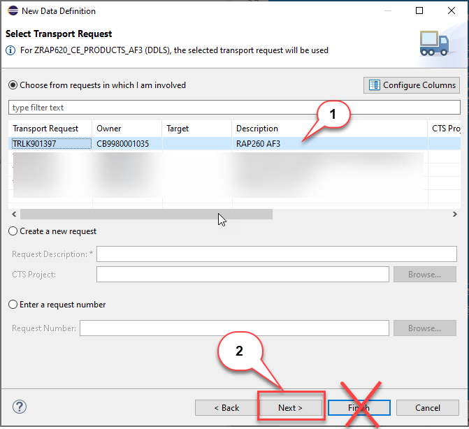

4. Select Template

   - Use the scroll bar to navigate down the list
   - Select the template **Define custom entity with parameters**
   - Press **Finish**

> **Please note**

> There is only a template for a custom entity with parameters. But this doesn’t matter. We use this template and remove the statement `with parameters parameter_name : parameter_type`.

 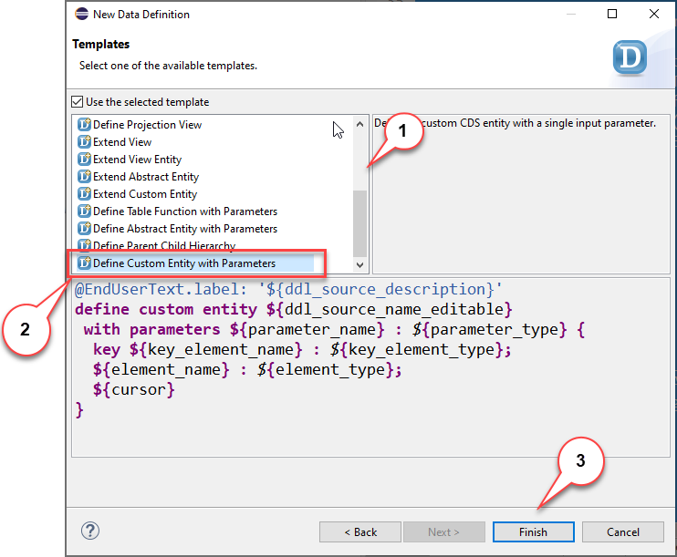

 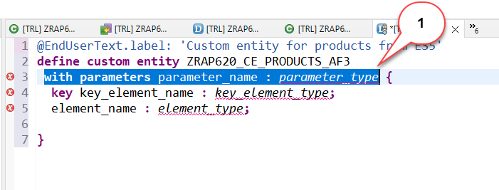

5. Edit the source code of the custom entity

   - From the abstract entity that is used by the service consumption model we only use the following three fields for your value help: `Product`, `ProductCategory` and `Supplier`.
   - We add the annotation `@ObjectModel.query.implementedBy: 'ABAP:ZRAP620_CL_CE_PRODUCTS_###'` right before the `define custom entity` statement.

The DDL source code should now look like follows:

<pre>
@EndUserText.label: 'Custom entity for products from ES5'
@ObjectModel.query.implementedBy: 'ABAP:ZRAP620_CL_CE_PRODUCTS_###'
define custom entity ZRAP620_CE_PRODUCTS_###
{
  key Product                 : abap.char( 10 );
      ProductCategory         : abap.char( 40 );
      Supplier                : abap.char( 10 );  
}

</pre>

   [Source code ZRAP260_CE_PRODUCTS_###](sources/ex2_DDLS_ZCE_RAP_PRODUCTS_%23%23%23%23.txt)

7. Activate your changes 

> You might get the warning that the class ` ZRAP260_CE_PRODUCTS_###` is not found. This is because our class does not yet implement the interface `IF_RAP_QUERY_PROVIDER`.  

</details>

### Implement the query implemenation class ZRAP260_CE_PRODUCTS_###
[^Top of page](#)

After having created the custom entity `ZRAP620_CE_PRODUCTS_###` we now have to enhance the query implementation class `ZRAP620_CL_CE_PRODUCTS_###` that we have created earlier in this exercise.

<details>
<summary>Click to expand</summary>

1. Add interface **`IF_RAP_QUERY_PROVIDER`** to the query implementation class **`ZRAP620_CL_CE_PRODUCTS_###`**
 
   - You can use the quick fix `Ctrl+1` to add the implementation for the method `if_rap_query_provider~select`
  
<pre>
  INTERFACES if_rap_query_provider.
</pre>
  
  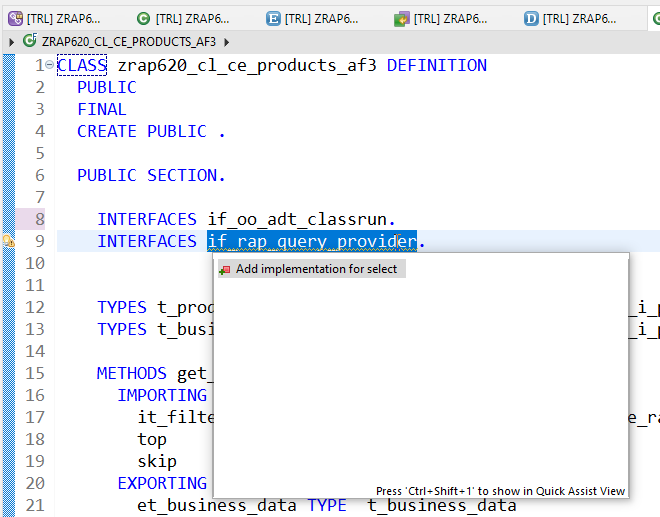
  
   
  
2. Implement the method  `if_rap_query_provider~select`  
  
Within the `select()` method we can retrieve the details of the incoming OData call using the object `io_request`. Using the method `get_paging()` we can find out whether client side paging was requested with the incoming OData call. Using the method `get_filter()` we can retrieve the filter that was used by the incoming OData request as ranges. This comes in handy so we can provide this data when calling the method `get_products()`.

**Please note:**
It is mandatory that the response not only contains the retrieved data via the method `set_data()` but also the number of entities being returned via the method `set_total_number_of_records()`.

[Source code zcl_ce_rap_products_####](sources/ex2_CLAS_zcl_ce_rap_products_%23%23%23%23_step_2.txt)

 <pre>

   METHOD if_rap_query_provider~select.
    DATA business_data TYPE t_business_data.
    DATA(top)     = io_request->get_paging( )->get_page_size( ).
    DATA(skip)    = io_request->get_paging( )->get_offset( ).
    DATA(requested_fields)  = io_request->get_requested_elements( ).
    DATA(sort_order)    = io_request->get_sort_elements( ).

    TRY.
        DATA(filter_condition) = io_request->get_filter( )->get_as_ranges( ).

        get_products(
                 EXPORTING
                   it_filter_cond    = filter_condition
                   top               = CONV i( top )
                   skip              = CONV i( skip )
                 IMPORTING
                   et_business_data  = business_data
                 ) .

        io_response->set_total_number_of_records( lines( business_data ) ).
        io_response->set_data( business_data ).

      CATCH cx_root INTO DATA(exception).
        DATA(exception_message) = cl_message_helper=>get_latest_t100_exception( exception )->if_message~get_longtext( ).
    ENDTRY.
  ENDMETHOD.

 
 </pre>

3. Activate your changes 

4. Your ABAP source code should now look like follows

[Source code ZCL_CE_RAP_PRODUCTS_####](sources/ex2_CLAS_zcl_ce_rap_products_%23%23%23%23_final.txt)

</details>

## Add the custom entity to your service definition

We now have to add the custom entity to the service definition of our inventory application.   

<details>
<summary>Click to expand</summary>

1. Open the Service Definition `ZRAP620_UI_INVENTORY_###` 

   - add the statement  
     <pre>expose ZRAP620_CE_PRODUCTS_### as Products;</pre>  
     so that the custom entity is added to the OData service.  
   - Activate your changes 
 
  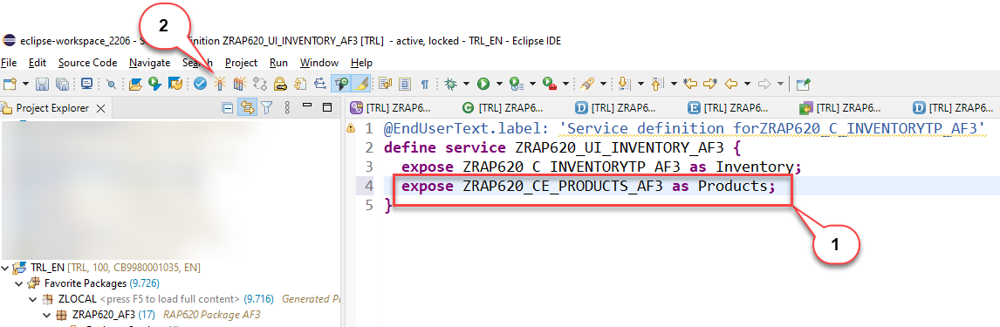  

</details>

## Add the custom entity as a value help
[^Top of page](#)

The custom entity can now be added as a value help.  

<details>
<summary>Click to expand</summary>

1. Open the projection view for your inventory data `ZRAP620_C_INVENTORYTP_###` 

  -  Add the annotation `@Consumption.valueHelpDefinition` to the field `ProductID`
  
  <pre>
  @Consumption.valueHelpDefinition: [{ entity : {name: 'ZRAP620_CE_PRODUCTS_###', element: 'Product'  } , useForValidation: true }]  
  </pre>

This will add the custom entity `ZRAP620_CE_PRODUCTS_###` as a value help for the field `ProductId`.

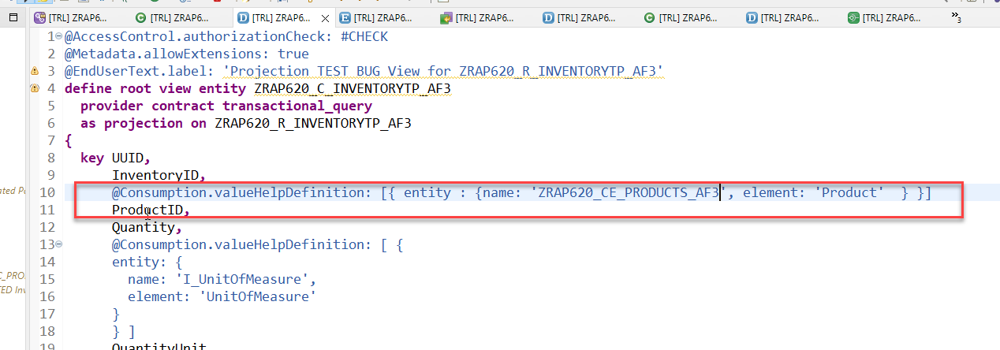  

</details>

## Test the service 
[^Top of page](#)

We can now test our service implementation.

<details>
<summary>Click to expand</summary>

1. Open the service binding `ZRAP620_UI_INVENTOR_O4_###` 

   - You will notice that now two entities are visible. `Products` and `Inventory`
   - Double-click on the entity `Inventory` or select it and use the **Preview** button.
   
     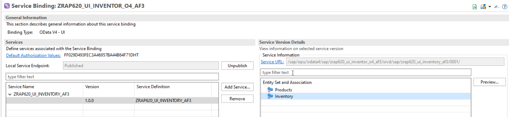

 
 
2. Use the new value help

   - Create a new inventory
   - Click on the value help icon
   - Select a product
    
    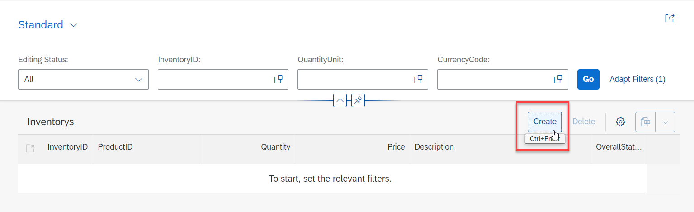

    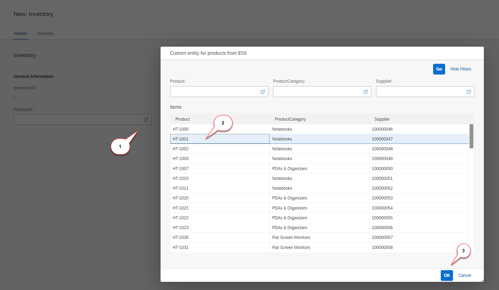
   
   


3. Create the new inventory 
 
  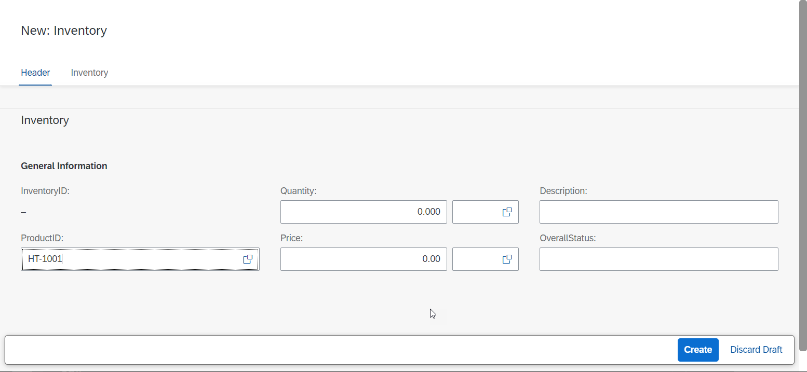

4. Check the result

  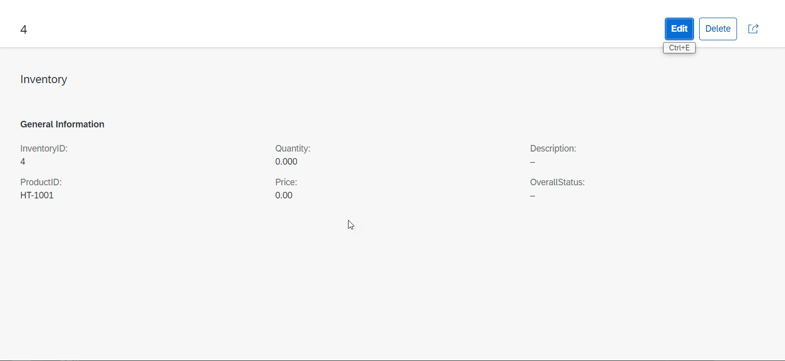

## Test input Validation on the front end
[^Top of page](#)

1. Edit the newly created inventory entry

2. Change the product name to a product name that does not exist, e.g. by adding an arbritray character `a`.

   You will see that the SAP Fiori Elements UI performs a check whether the entered product name `HT-1001a`does exist.

   This is because we have add earlier the annotation `@Consumption.valueHelpDefinition` to the field `ProductID` with the addtional parameter `useForValidation`.

<pre>
@Consumption.valueHelpDefinition: [{ entity : {name: 'ZRAP620_CE_PRODUCTS_AF3', element: 'Product'  } , useForValidation: true }]        
</pre>

   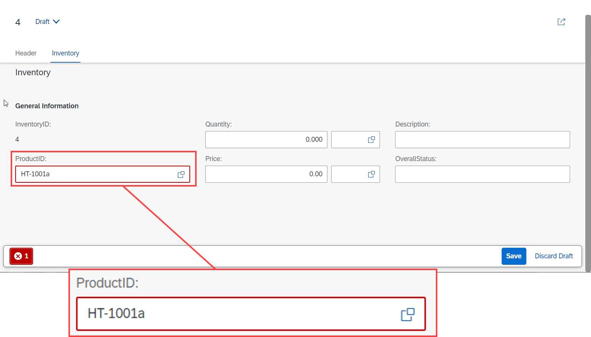

   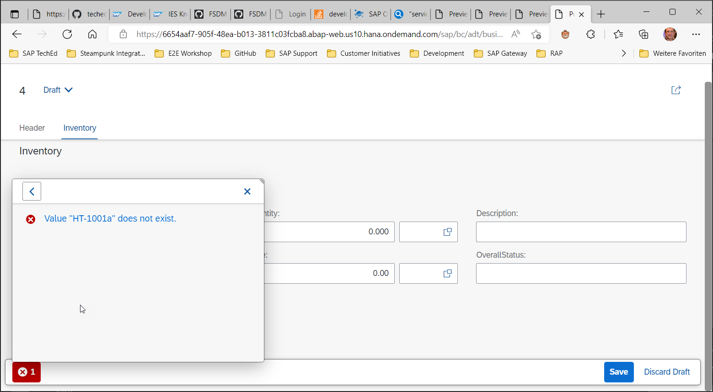

  
</details>

## Summary
[^Top of page](#)

You are now able to:

-	Explore an existing application with the Fiori Elements preview  
- Consume external OData Service using the Service Consumption Model  
-	Create and expose Custom Entites  
-	Implement Custom Queries for Custom Entities  
-	Define value helps for OData entities   


Continue to - [Exercise 4 - Excercise 4 ](../ex4/README.md/#exercise-4---consume-a-soap-web-service)
