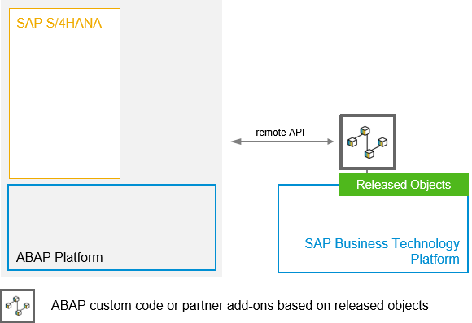
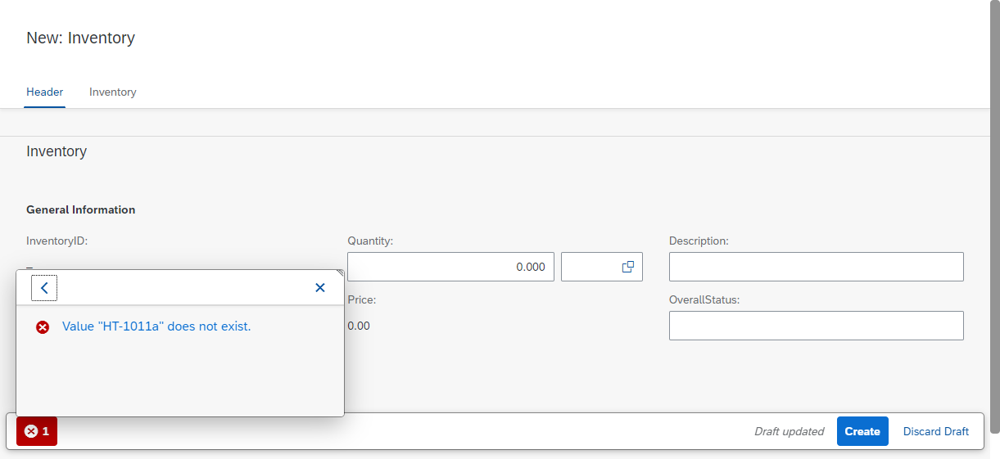

# RAP620: Side-by-side extensibility with SAP BTP ABAP Environment

<!-- 
## Description
-->

This repository contains the material for the hands-on session **RAP620: Side-by-side extensibility with SAP BTP ABAP Environment**.

SAP BTP ABAP Environment (aka _Steampunk_) allows the development loosely coupled side-by-side extensions for SAP S/4HANA on top of SAP BTP ABAP Environment. 

- [Requirements for attending this workshop](#requirements-for-attending-this-workshop)
- [Overview](#overview)
- [Business scenario](#business-scenario)
- [Exercises](#exercises)
- [How to obtain support](#how-to-obtain-support) 
- [Further Information](#further-information)

## Requirements for attending this workshop 
[^Top of page](#)

In order to participate in this hands-on session, you must have installed the latest version of Eclipse and the latest version of the ABAP Development Tools (ADT) in Eclipse and you must have a user in a SAP BTP ABAP Environment system. 

How to obtain an ADT installation and how to obtain a user in SAP BTP trial check out our [Getting started document](exercises/ex0/README.md).

## Overview
[^Top of page](#)

This hands-on workshop will guide you to build side-by-side extensions for an SAP S/4HANA backend system in an SAP BTP ABAP Environment system (aka _Steampunk_).

You will create your own transactional Fiori elements app with the ABAP RESTful Application Programming Model (RAP) and use remote enabled APIs (an OData service and a SOAP Web Service)provided by an SAP backend system to leverage existing data in SAP S/4HANA thereby extending existing functionality side-by-side in a Steampunk system.
 
In order to be able to build this scenario in the shared trial systems an OData service will be used that does not require authentication.

## Business Scenario 

Our scenario is an inventory application that runs on SAP BTP ABAP environment. This application will use product master data from an on premise SAP S/4HANA system that will be retrieved via calling an OData service and via calling a SOAP web service.

 
Click to expand!

 
 **Create a custom BO for a specific business context and integrate remote OData services**

 For that, you will build a custom business object with RAP to manage inventory data. The product data is being retrieved from the SAP backend system using public remote enabled API's.  
 
 To speed up the development we will use a wizard in ADT that generates the complete stack of a RAP business object based on a single existing table. This allows us to skip writing lots of boiler plate coding that you otherwise would have to write yourself.   
  
 The product data is being retrieved from the SAP backend system using an OData service. In addition we use a SOAP Web service to read the price of a product to showcase that remote APIs based on various protocols are supported (OData, SOAP, RFC).
 
You’ll enhance the generated application by enriching it with additonal UI annotations, and display it in a SAP Fiori elements based List Report.  
Then you’ll enable the consumption of the remote OData and SOAP services by enhancing the business object (BO) with a value help that is based on a custom entity and a determination that calls the remote SOAP Web service.

Your application will finally look like this:

## Exercises
[^Top of page](#)

| Exercises |  
| ------------- | 
| [Exercise 1: Generate a starter application](exercises/ex1/README.md/#toc) | 
| [Exercise 2: Adapt the generated code](exercises/ex2/README.md/#toc)|
| [Exercise 3: Consume an OData service](exercises/ex3/README.md/#toc) | 
| [Exercise 4: Consume a SOAP Web service](exercises/ex4/README.md/#toc) | 

## How to obtain support
[^Top of page](#)

Support for the content in this repository is available during the actual time of the online session for which this content has been designed. Otherwise, you may request support via the [Issues](../../../../issues) tab.

## Further Information
[^Top of page](#)

You can find further information on the different topics here: 
- [SAP S/4HANA Cloud ABAP Environment](https://community.sap.com/topics/s4hana-cloud-abap-environment)
- [New ABAP Platform Extensibility Options for SAP S/4HANA](https://blogs.sap.com/2021/11/19/new-abap-platform-extensibility-options-in-2021/)
- [Embedded Steampunk - Some more details for ABAP developers](https://blogs.sap.com/2022/09/05/embedded-steampunk-some-more-details-for-abap-developers/)
- [Getting Started with the ABAP RESTful Application Programming Model (RAP)](https://blogs.sap.com/2019/10/25/getting-started-with-the-abap-restful-programming-model/)
- [ABAP Extensibility Topic Page @SAP Community](https://community.sap.com/topics/abap-extensibility)

## License
Copyright (c) 2022 SAP SE or an SAP affiliate company. All rights reserved. This file is licensed under the Apache Software License, version 2.0 except as noted otherwise in the [LICENSE](LICENSES/Apache-2.0.txt) file.
