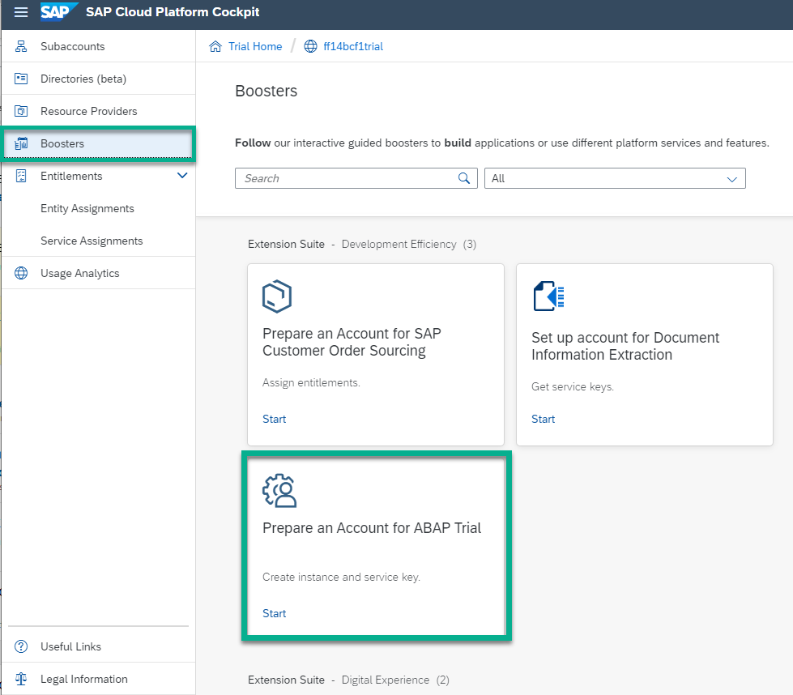

# Requirements needed to participate in a ABAP Platform RAP workshop

In order to participate in an ABAP Platform RAP workshop you have prepare three things beforehand:

- Sign up for a free trial account on SAP BTP  
- Create a SAP BTP ABAP Environment Trial User  
- Install the ABAP Development Tools (ADT) on your laptop

## 1. Get a Free Account on SAP BTP Trial  

You have signed up for a free trial account on SAP BTP: [Get a Free Account on SAP BTP Trial](https://developers.sap.com/tutorials/hcp-create-trial-account.html).

## 2. Create an SAP BTP ABAP Environment Trial User

You have prepared your ABAP Trial which can be easily be done via the [SAP Cloud Platform cockpit](https://cockpit.hanatrial.ondemand.com) in just 3 steps.
  - Click on Enter **Your Trial Account**.
  
  - Click on **Boosters** in the menu on the left hand side
  - Choose the tile **Prepare an Account for ABAP Trial** and follow the wizard
  

  For a detailed step-by-step description check out our [Onboarding Tutorial](https://help.sap.com/viewer/65de2977205c403bbc107264b8eccf4b/Cloud/en-US/720c423ef1a8498ab690cf0e5512ba50.html#loio720c423ef1a8498ab690cf0e5512ba50__Create_ABAP_Trial_Instance).
  
## 3. You have installed the ABAP Development Tools (ADT)  

In order to install the ABAP Development Tools (ADT) we strongly recommend to use the Eclipse Installer 2021 03 R which now includes a JRE for macOS, Windows and Linux.

- Download the [latest Eclipse installer version](https://www.eclipse.org/downloads/packages/installer)  
- Start the installer.   
- When being asked by the installer choose the **Eclipse IDE for Java Developers**  
- Start your newly installed Eclipse  
- In Eclipse, choose in the menu bar **Help > Install New Software...**  
- Enter the URL https://tools.hana.ondemand.com/latest  
- Press **Enter** to display the available features.  
- Select **ABAP Core Development Tools (Developer Edition)** and choose **Next**.  
- Continue with the wizard and confirm the license confirmation popup. 
